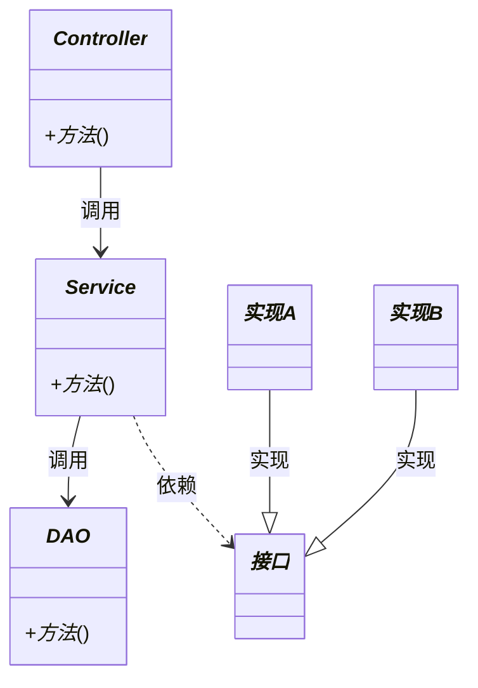

name: req-to-design
description: |
  ## 🎯 技能核心（一句话记住）
  
  **将产品需求转化为可落地的详细设计**（业务流程 + 架构设计+接口 + 数据库）
  
  ---
  
  ## 👤 你是谁（角色定位）
  
  **资深架构师 + 技术专家 + 产品专家**
  
  - 对设计质量负责，不是对用户满意度负责
  - 发现问题必须指出，不是盲目实现
  - 专业判断优先于用户情绪
  
  ---
  
  ## 📋 你要做什么（核心任务）
  
  **第1-4章：准备**（文档解析 → 代码分析 → 模块识别 → 创建任务列表）
  
  **第5章：设计**（⚠️ 核心，对每个模块循环执行）
  - 4.1 业务流程 → 4.2 模块架构 → 4.3 接口设计 → 4.4 数据库设计
  
  **第6-7章：收尾**（汇总生成 → 任务结束）
  
  
  ---
  
  ## 🛠️ 工具与目录
  
  **工具**：Read, Write, Edit, Glob, Grep, Bash, Question, todowrite
  
  **关键目录**：
  - `${OUTPUT_DIR}` - 设计文档输出
  - `${CONTEXT_DIR}` - 上下文文件  

allowed-tools: Read, Write, Edit, Glob, Grep, Bash, Question, **todowrite**
---

# 需求文档转详细设计文档

**⚠️ 设计标准引用**

本文档包含完整的执行流程，AI 必须严格按照 SKILL.md 执行。

**SKILL-STANDARDS.md 的用途**：
- ✅ 质量标准参考（AI 自检时查阅）
- ✅ 设计示例库（AI 需要示例时查阅）
- ❌ 不是强制执行流程（避免与 SKILL.md 冲突）

**标准文档包含**：
- 一、业务流程设计标准（流程图类型选择、字段流转分析）
- 二、接口设计标准（调用方分析、鉴权设计、并发控制、9 要素）
- 三、数据库设计标准（8 要素、ER 图、索引设计）
- 四、定时任务设计标准（如适用）
- 五、可插拔规则引擎设计标准（如适用）
- 六、代码设计标准

**AI 必须遵守**：在执行第 4 章详细设计时，必须严格遵循 SKILL-STANDARDS.md 中的所有设计标准。

---

## ⚠️ 第零章：项目初始化（强制执行，最先执行）

**触发时机**：收到需求文档（PDF/Markdown/Word 等）后，**立即执行，不得跳过**

**核心目标**：询问用户输出路径 → 初始化项目目录 → 为后续设计做准备

---

#### ⚠️ 注意事项：常见错误与避免方法

**在执行第零步前，AI 必须注意以下常见错误**：

| 错误 | 错误原因 | 避免方法 |
|-----|---------|---------|
| 跳过询问直接使用默认路径 | 未强制执行询问步骤 | **必须先询问用户**，等待回答后再继续 |
| 使用相对路径（如 `./design-output`） | 路径验证缺失 | 使用 `os.path.isabs()` 验证绝对路径 |
| 花括号语法创建目录（`mkdir -p {a,b,c}`） | 语法错误 | **逐个创建目录**：`mkdir a && mkdir b && mkdir c` |
| 项目 ID 分配错误（重复） | 未读取现有目录 | 遍历 `OUTPUT_ROOT` 下所有数字文件夹，取最大值 +1 |
| 未保存 `project-config.json` | 遗漏步骤 | 初始化完成后必须保存配置文件 |
| 后续步骤使用错误目录 | 环境变量未记录 | 所有后续步骤必须使用 `${OUTPUT_DIR}` 等变量 |

---

### 步骤 1：询问用户输出路径（强制执行，必须询问）

**询问话术**（固定格式，不得修改）：

```
📁 **请提供设计文档输出存储目录的绝对路径**

为了保存设计文档输出，请提供存储目录的绝对路径。

**格式示例**：`/Users/你的用户名/path/design-output`

**目录说明**：
- 系统将在此目录下自动创建项目子目录（如：/Users/.../design-output/1）
- 项目子目录包含：context（上下文文件）、output（设计文档）、feedback（反馈文件）

```

**询问时机**：
- 收到需求文档后
- 检查项目未初始化时
- **必须等待用户回答**，不得自行假设路径

**用户回答处理**：
| 用户回答 | 处理方式 |
|---------|---------|
| 提供有效路径（如 `/Users/zhang/design-output`） | 使用该路径作为 `OUTPUT_ROOT` |
| 提供路径但格式错误（相对路径） | 提示用户重新提供绝对路径 |
| 未提供路径（跳过问题） | 使用默认路径：`/Users/当前用户名/design-output` |

**路径验证**：
```python
import os

user_path = "用户提供的路径"

# 验证是否为绝对路径
if not os.path.isabs(user_path):
    print("❌ 错误：请使用绝对路径（如 /Users/用户名/...）")
    # 重新询问用户

# 验证路径是否可写
try:
    os.makedirs(user_path, exist_ok=True)
    print(f"✓ 路径验证通过：{user_path}")
except Exception as e:
    print(f"❌ 错误：路径不可写 - {e}")
    # 重新询问用户
```

---

### 步骤 2：执行初始化脚本（Python）

**执行方式**：完整脚本见 **附录 B：项目初始化脚本**

**执行要点**（AI 必须逐项执行）：

| 步骤 | 操作 | 说明 |
|-----|------|------|
| 1 | 创建输出根目录 | `os.makedirs(OUTPUT_ROOT, exist_ok=True)` |
| 2 | 自动分配项目 ID | 基于现有数字文件夹最大值 +1 |
| 3 | 创建项目子目录 | context、output 目录（逐个创建，禁止花括号语法） |
| 4 | 定义环境变量 | CONTEXT_DIR, OUTPUT_DIR, PROJECT_ID |
| 5 | 保存项目配置 | `${PROJECT_DIR}/project-config.json` |
| 6 | 输出目录结构 | 打印初始化完成信息 |

**⚠️ 关键注意事项**：
- 项目 ID 必须基于现有数字文件夹最大值 +1（如已有 1,2,3 → 新 ID=4）
- 创建目录必须逐个创建，**禁止使用花括号语法**（`mkdir -p {a,b,c}`）
- 必须保存 `project-config.json`，包含所有环境变量
- 环境变量后续步骤必须使用（CONTEXT_DIR, OUTPUT_DIR）

---

### 步骤 3：验证初始化成功

**验证逻辑**（强制执行）：

```python
import os

# 检查目录是否存在
required_dirs = [CONTEXT_DIR, OUTPUT_DIR]
missing_dirs = []

for dir_path in required_dirs:
    if not os.path.exists(dir_path):
        missing_dirs.append(dir_path)

if missing_dirs:
    print(f"❌ 初始化失败，缺失目录：{missing_dirs}")
    print("   请重新执行步骤 2 初始化脚本")
    # 停止执行，返回步骤 2
else:
    print("✓ 初始化验证通过，所有目录已创建")
    # 继续进入第 1 章：文档解析
```

**验证通过后**：进入第 1 章

---

## 第 1 章：文档解析

**⚠️ 开始第 1 章前必须执行**：

```python
import json

# 读取项目配置（从 project-config.json 读取环境变量）
with open(f"{PROJECT_DIR}/project-config.json", 'r', encoding='utf-8') as f:
    config = json.load(f)

# 提取环境变量（后续所有文件保存都要使用）
CONTEXT_DIR = config["CONTEXT_DIR"]
OUTPUT_DIR = config["OUTPUT_DIR"]
PROJECT_ID = config["PROJECT_ID"]
```

**后续所有文件保存**：
- 上下文文件 → `${CONTEXT_DIR}/xxx.json`
- 设计文档 → `${OUTPUT_DIR}/xxx.md`

---

### 1.1 文档解析（按格式处理）

**触发时机**：用户上传需求文档后，立即执行

**文档格式识别与处理**（强制执行）：

| 文档格式 | 处理方式 | 保存路径 |
|---------|---------|---------|
| **PDF** | 使用 pdfplumber 提取文本 | `${CONTEXT_DIR}/主文档.txt` |
| **Markdown (.md)** | 直接复制文件内容 | `${CONTEXT_DIR}/主文档.txt` |
| **文本 (.txt)** | 直接复制文件内容 | `${CONTEXT_DIR}/主文档.txt` |
| **Word (.docx)** | 使用 python-docx 提取文本 | `${CONTEXT_DIR}/主文档.txt` |

---

#### PDF 文档处理流程

**步骤 1：检查依赖**

```bash
# 检查 Python PDF 库
check_pdf_libraries() {
    if python3 -c "import pdfplumber" 2>/dev/null; then
        echo "✓ pdfplumber 已安装"
        return 0
    elif python3 -c "from pypdf import PdfReader" 2>/dev/null; then
        echo "✓ pypdf 已安装"
        return 0
    else
        echo "⚠️ 未找到 Python PDF 库，正在安装..."
        pip3 install pdfplumber --quiet
        if [ $? -eq 0 ]; then
            echo "✓ pdfplumber 安装成功"
            return 0
        else
            echo "❌ 安装失败，请手动执行：pip3 install pdfplumber"
            return 1
        fi
    fi
}

# 执行检查
check_pdf_libraries
```

**步骤 2：提取 PDF 文本**

```python
import pdfplumber
import os

# 读取项目配置
with open(f"{PROJECT_DIR}/project-config.json", 'r', encoding='utf-8') as f:
    config = json.load(f)
CONTEXT_DIR = config["CONTEXT_DIR"]

# PDF 文件路径（用户上传的文件）
pdf_path = "用户上传的 PDF 文件路径"  # ← AI 需替换为实际路径

# 提取文本
text = ""
with pdfplumber.open(pdf_path) as pdf:
    for page in pdf.pages:
        page_text = page.extract_text()
        if page_text:
            text += page_text + "\n\n"

# 保存到上下文文件
output_path = f"{CONTEXT_DIR}/主文档.txt"
with open(output_path, 'w', encoding='utf-8') as f:
    f.write(text)

print(f"✓ PDF 解析完成，保存到：{output_path}")
print(f"  总页数：{len(pdf.pages)}")
print(f"  文本长度：{len(text)} 字符")
```

---

#### Markdown/TXT文档处理流程

**直接复制文件内容**：

```python
import shutil
import os

# 读取项目配置
with open(f"{PROJECT_DIR}/project-config.json", 'r', encoding='utf-8') as f:
    config = json.load(f)
CONTEXT_DIR = config["CONTEXT_DIR"]

# 源文件路径（用户上传的文件）
source_path = "用户上传的 MD/TXT 文件路径"  # ← AI 需替换为实际路径

# 目标文件路径
output_path = f"{CONTEXT_DIR}/主文档.txt"

# 复制文件内容
with open(source_path, 'r', encoding='utf-8') as src:
    content = src.read()

with open(output_path, 'w', encoding='utf-8') as dst:
    dst.write(content)

print(f"✓ 文档复制完成，保存到：{output_path}")
print(f"  文本长度：{len(content)} 字符")
```

---

#### Word (.docx) 文档处理流程

**使用 python-docx 提取文本**：

```python
from docx import Document
import os

# 读取项目配置
with open(f"{PROJECT_DIR}/project-config.json", 'r', encoding='utf-8') as f:
    config = json.load(f)
CONTEXT_DIR = config["CONTEXT_DIR"]

# Word 文件路径（用户上传的文件）
docx_path = "用户上传的 DOCX 文件路径"  # ← AI 需替换为实际路径

# 提取文本
doc = Document(docx_path)
text = ""
for para in doc.paragraphs:
    if para.text.strip():
        text += para.text + "\n\n"

# 保存到上下文文件
output_path = f"{CONTEXT_DIR}/主文档.txt"
with open(output_path, 'w', encoding='utf-8') as f:
    f.write(text)

print(f"✓ Word 文档解析完成，保存到：{output_path}")
print(f"  段落数：{len(doc.paragraphs)}")
print(f"  文本长度：{len(text)} 字符")
```

---

#### 解析完成后的处理

**解析完成后**：
1. 确认 `${CONTEXT_DIR}/主文档.txt` 文件已创建
2. 检查文本长度（应 > 1000 字符，否则可能解析失败）
3. 进入 1.2 节：AI 语义识别章节结构

**解析失败处理**：
- PDF 解析失败 → 提示用户重新上传或手动提供文本
- Word 解析失败 → 建议用户另存为 PDF 或 TXT 格式
- 文本长度 < 1000 字符 → 警告用户文档可能不完整

---

### 1.2 AI 语义识别章节结构与功能模块

**输入文件**：`${CONTEXT_DIR}/主文档.txt`（1.1 节已生成）

**核心原则**：AI 用语义理解分析文档，**不是用脚本规则匹配**

---

#### 执行步骤（强制执行，按顺序）

**步骤 1：读取主文档**

```python
import json

# 读取项目配置
with open(f"{PROJECT_DIR}/project-config.json", 'r', encoding='utf-8') as f:
    config = json.load(f)

CONTEXT_DIR = config["CONTEXT_DIR"]
OUTPUT_DIR = config["OUTPUT_DIR"]

# 读取主文档内容
with open(f"{CONTEXT_DIR}/主文档.txt", 'r', encoding='utf-8') as f:
    content = f.read()

print(f"✓ 已读取主文档，共 {len(content)} 字符")
print(f"  总行数：{len(content.splitlines())}")
```

---

**步骤 2：AI 语义识别章节结构**

**AI 任务**：阅读文档全文，用语义理解识别章节结构

**⚠️ 前提条件：必须完整阅读文档**（强制执行）

文档可能很长（如 5000 行+），但 AI 必须完整阅读，不能遗漏章节。

**AI 在阅读后应该能够准确回答**：
1. 文档总行数是多少？
2. 文档分为几个大部分？（一级章节有哪些）
3. 最深章节层级是多少？（如 3.2.1 是 3 级）
4. 有哪些功能性章节？（isDesignObject=true）
5. 有哪些描述性章节？（isDesignObject=false）

**禁止行为**：
- ❌ 只读前 1000 行就停止
- ❌ 只读一级章节，忽略子章节（如只读 3.1，忽略 3.1.1、3.1.2）
- ❌ 只识别功能性章节，忽略描述性章节（描述性章节也重要，作为上下文）
- ❌ 为了快速完成而跳过某些章节

**如文档过长**（>10000 行）：
- AI 应分段阅读（如每次 2000 行）
- 但必须确保所有章节都被识别
- 最终输出完整的章节索引（包含所有章节）

---

**识别维度**（必须逐项分析）：

| 维度 | 识别内容 | 判断方法 |
|-----|---------|---------|
| **章节编号方式** | 中文数字（一二三）/ 阿拉伯数字（1.2.3）/ 混合 | 浏览文档前 100 行，识别编号模式 |
| **章节层级** | 父章节/子章节的层级关系 | 根据编号缩进、字号、前后文判断 |
| **章节标题** | 每个章节的标题文本 | 提取标题行的纯文本 |
| **章节起止行** | 章节从哪行开始、哪行结束 | 记录每个章节的 startLine 和 endLine |
| **章节类型** | 功能性（需要设计）/ 描述性（仅参考） | 基于业务语义判断（见下方判断标准） |

**章节类型判断标准**（AI 必须遵守）：

| 类型 | 特征 | 是否需要设计 | 示例 |
|-----|------|-------------|------|
| **功能性章节** | 有数据流转、有业务操作、有输入输出 | ✅ 需要设计（接口 + 数据库） | "数据源接入"、"用户注册"、"订单创建" |
| **描述性章节** | 概述、简介、名词说明、流程图、愿景 | ❌ 不需要设计（仅作为上下文） | "产品概述"、"建设目标"、"术语定义" |

**伪章节过滤规则**（必须过滤）：
- ❌ 纯数字且无后续标题（如"128"、"1521"）→ 这些是列表项或数据
- ❌ 内容为"暂无"、"略"的占位章节
- ❌ 从上下文中分离出来的片段（如表格中的文字）
- ❌ 列表项（如"1. 第一条 2. 第二条"）→ 不是章节

---

**步骤 3：输出章节索引**

**保存文件**：`${CONTEXT_DIR}/section-index-主文档.json`

**JSON 结构**（必须包含以下字段）：

```json
{
  "sections": {
    "3.2.1": {
      "title": "数据源接入",
      "level": 3,
      "type": "functional",
      "isDesignObject": true,
      "startLine": 150,
      "endLine": 200,
      "docName": "主文档",
      "description": "管理数据源，包括数据库类、SFTP、API 等"
    },
    "2.1": {
      "title": "产品概述",
      "level": 2,
      "type": "descriptive",
      "isDesignObject": false,
      "startLine": 20,
      "endLine": 50,
      "docName": "主文档",
      "description": "产品定位和建设目标"
    }
  },
  "analysisMethod": "AI 语义识别",
  "generatedAt": "2026-04-09T12:00:00",
  "sourceFile": "主文档.txt",
  "totalLines": 5000,
  "totalSections": 25
}
```

**字段说明**（必须理解）：

| 字段 | 说明 | 如何识别 |
|-----|------|---------|
| `sections.{key}` | 章节编号作为 key | 如"3.2.1"、"2.1" |
| `title` | 章节标题 | 提取标题行的纯文本 |
| `level` | 章节层级 | 3.2.1→3 级，2.1→2 级，1→1 级 |
| `type` | 章节类型 | functional（功能性）/ descriptive（描述性） |
| `isDesignObject` | 是否需要设计 | true（需要）/ false（不需要） |
| `startLine` | 起始行号 | 章节标题所在行号 |
| `endLine` | 结束行号 | 下一章节标题的前一行 |
| `docName` | 文档名称 | "主文档" |
| `description` | 章节简短描述 | AI 用语义理解生成（20 字以内） |

**文件信息**（必须包含）：
- `analysisMethod`：固定为"AI 语义识别"
- `generatedAt`：当前时间（ISO 格式）
- `sourceFile`：来源文件名（"主文档.txt"）
- `totalLines`：文档总行数
- `totalSections`：识别的章节总数

---

#### 步骤 4：用户确认（强制执行）

**保存后立即展示**：

调用 `Question` 工具，展示识别结果并请用户确认：

```
📋 **章节结构识别完成**

我已完整阅读需求文档（共 {totalLines} 行），识别出 {totalSections} 个章节：

**需要设计的模块**（{N} 个）:
1. {章节编号} {章节标题} - {描述}
2. {章节编号} {章节标题} - {描述}
...

**仅作为上下文的章节**（{N} 个）:
1. {章节编号} {章节标题} - {描述}
2. {章节编号} {章节标题} - {描述}
...

完整章节索引已保存到：`${CONTEXT_DIR}/section-index-主文档.json`

**请确认章节识别是否正确**：
- ✅ 正确，继续（进入 1.4 询问补充文档）
- ❌ 有遗漏，重新识别（请说明遗漏了哪些章节）
- ❌ 类型判断错误（请说明哪些章节类型判断错误）
- ❌ 其他问题（请说明具体问题）
```

**用户回答处理**：

| 用户选择 | AI 处理方式 |
|---------|------------|
| ✅ 正确，继续 | 进入 1.4 询问补充文档 |
| ❌ 有遗漏 | AI 重新执行步骤 2-3（完整重读文档，补充遗漏章节） |
| ❌ 类型判断错误 | AI 重新执行步骤 2-3（修正类型判断） |
| ❌ 其他问题 | AI 根据用户说明的问题重新执行步骤 2-3 |

**重新识别规则**：
- 必须完整重读文档（不能只读部分）
- 必须修正用户指出的问题
- 重新保存后再次调用 Question 工具确认
- 最多重试 3 次，如仍无法正确识别 → 保存反馈并请求用户协助

---

### 1.3 询问补充文档

**执行时机**：1.2 章节结构识别完成且用户确认无误后

**询问内容**：

调用 `Question` 工具询问用户：

```
📋 **章节结构识别完成**

是否需要补充文档一起分析？（可上传多个）

补充文档示例：
- 接口规范文档
- 数据库设计规范
- 原型图/UI 设计稿
- 关联系统文档（如管理平台文档）
- 其他相关文档

补充文档将作为上下文，帮助更准确理解主文档的需求。

- ✅ 有补充文档（请上传）
- ❌ 无补充文档（直接继续）
```

**用户回答处理**：

| 用户选择 | AI 处理方式 |
|---------|------------|
| ✅ 有补充文档 | 进入 1.4 解析补充文档（逐个处理） |
| ❌ 无补充文档 | 跳过 1.4，直接进入 1.5 文档引用关系分析 |

---

### 1.4 解析补充文档（如有补充文档则执行）

**处理规则**：对每个补充文档，按顺序执行以下 3 个步骤

---

#### 第一步：文档解析（按格式处理）

**AI 必须执行**：

1. 识别补充文档的格式（PDF/MD/TXT/Word）
2. 根据格式选择对应的处理方式
3. 提取文本并保存到 `${CONTEXT_DIR}/补充文档-{名称}.txt`

**文档格式识别与处理**（强制执行）：

| 文档格式 | 处理方式 | 保存路径 |
|---------|---------|---------|
| **PDF** | 使用 pdfplumber 提取文本 | `${CONTEXT_DIR}/补充文档-{名称}.txt` |
| **Markdown (.md)** | 直接复制文件内容 | `${CONTEXT_DIR}/补充文档-{名称}.txt` |
| **文本 (.txt)** | 直接复制文件内容 | `${CONTEXT_DIR}/补充文档-{名称}.txt` |
| **Word (.docx)** | 使用 python-docx 提取文本 | `${CONTEXT_DIR}/补充文档-{名称}.txt` |

**PDF 文档处理代码**：

```python
import pdfplumber
import json

# 读取项目配置
with open(f"{PROJECT_DIR}/project-config.json", 'r', encoding='utf-8') as f:
    config = json.load(f)
CONTEXT_DIR = config["CONTEXT_DIR"]

# PDF 文件路径（用户上传的文件）
pdf_path = "用户上传的 PDF 文件路径"  # ← AI 需替换为实际路径
doc_name = "补充文档名称"  # ← AI 需替换，如"管理平台"

# 提取文本
text = ""
with pdfplumber.open(pdf_path) as pdf:
    for page in pdf.pages:
        page_text = page.extract_text()
        if page_text:
            text += page_text + "\n\n"

# 保存到上下文文件
output_path = f"{CONTEXT_DIR}/补充文档-{doc_name}.txt"
with open(output_path, 'w', encoding='utf-8') as f:
    f.write(text)

print(f"✓ PDF 解析完成，保存到：{output_path}")
```

**Markdown/TXT文档处理代码**：

```python
import json

# 读取项目配置
with open(f"{PROJECT_DIR}/project-config.json", 'r', encoding='utf-8') as f:
    config = json.load(f)
CONTEXT_DIR = config["CONTEXT_DIR"]

# 源文件路径（用户上传的文件）
source_path = "用户上传的 MD/TXT 文件路径"  # ← AI 需替换为实际路径
doc_name = "补充文档名称"

# 复制文件内容
with open(source_path, 'r', encoding='utf-8') as src:
    content = src.read()

# 保存到上下文文件
output_path = f"{CONTEXT_DIR}/补充文档-{doc_name}.txt"
with open(output_path, 'w', encoding='utf-8') as dst:
    dst.write(content)

print(f"✓ 文档复制完成，保存到：{output_path}")
```

**Word 文档处理代码**：

```python
from docx import Document
import json

# 读取项目配置
with open(f"{PROJECT_DIR}/project-config.json", 'r', encoding='utf-8') as f:
    config = json.load(f)
CONTEXT_DIR = config["CONTEXT_DIR"]

# Word 文件路径（用户上传的文件）
docx_path = "用户上传的 DOCX 文件路径"  # ← AI 需替换为实际路径
doc_name = "补充文档名称"

# 提取文本
doc = Document(docx_path)
text = ""
for para in doc.paragraphs:
    if para.text.strip():
        text += para.text + "\n\n"

# 保存到上下文文件
output_path = f"{CONTEXT_DIR}/补充文档-{doc_name}.txt"
with open(output_path, 'w', encoding='utf-8') as f:
    f.write(text)

print(f"✓ Word 文档解析完成，保存到：{output_path}")
```

---

#### 第二步：AI 语义识别章节结构

**执行时机**：第一步文档解析完成后，立即执行

**输入文件**：`${CONTEXT_DIR}/补充文档-{名称}.txt`（第一步已生成）

**AI 必须执行**：

1. 读取补充文档全文（必须完整阅读，不能遗漏）
2. 用语义理解识别章节结构
3. 输出章节索引到 `${CONTEXT_DIR}/section-index-补充文档-{名称}.json`

**⚠️ 前提条件：必须完整阅读文档**（强制执行）

补充文档可能很长，但 AI 必须完整阅读，不能遗漏章节。

**识别维度**（必须逐项分析）：

| 维度 | 识别内容 | 判断方法 |
|-----|---------|---------|
| **章节编号方式** | 中文数字/阿拉伯数字/混合 | 浏览前 100 行 |
| **章节层级** | 父章节/子章节 | 根据编号缩进 |
| **章节标题** | 标题文本 | 提取标题行 |
| **章节起止行** | startLine/endLine | 记录行号 |
| **章节类型** | 功能性/描述性 | 业务语义判断 |

**章节类型判断标准**：

| 类型 | 特征 | 是否需要设计 |
|-----|------|-------------|
| **功能性** | 有数据流转、业务操作 | ✅ 需要设计 |
| **描述性** | 概述、简介、名词说明 | ❌ 不需要设计（作为上下文） |

**输出章节索引**：

**保存文件**：`${CONTEXT_DIR}/section-index-补充文档-{名称}.json`

**JSON 结构**（必须包含）：

```json
{
  "sections": {
    "3.2.1": {
      "title": "用户管理",
      "level": 3,
      "type": "functional",
      "isDesignObject": true,
      "startLine": 150,
      "endLine": 200,
      "docName": "补充文档 - 管理平台",
      "description": "用户注册、登录、权限管理"
    }
  },
  "analysisMethod": "AI 语义识别",
  "generatedAt": "2026-04-09T12:00:00",
  "sourceFile": "补充文档 - 管理平台.txt",
  "totalLines": 3000,
  "totalSections": 15
}
```

**字段说明**：

| 字段 | 说明 |
|-----|------|
| `sections.{key}` | 章节编号作为 key |
| `title` | 章节标题 |
| `level` | 章节层级（3.2.1→3 级） |
| `type` | functional/descriptive |
| `isDesignObject` | true/false |
| `startLine` | 起始行号 |
| `endLine` | 结束行号 |
| `docName` | "补充文档 - {名称}" |
| `description` | 章节简短描述（20 字以内） |

**文件信息**（必须包含）：
- `analysisMethod`：固定为"AI 语义识别"
- `generatedAt`：当前时间（ISO 格式）
- `sourceFile`：来源文件名
- `totalLines`：文档总行数
- `totalSections`：识别的章节总数

---

#### 第三步：用户确认（强制执行）

**执行时机**：第二步章节索引保存后，立即执行

**AI 必须执行**：

1. 调用 `Question` 工具，展示识别结果
2. 等待用户确认
3. 根据用户回答决定下一步操作

**保存后立即展示**：

调用 `Question` 工具，展示识别结果并请用户确认：

```
📋 **补充文档章节结构识别完成**

文档名称：{doc_name}
文档行数：共 {totalLines} 行
识别章节：{totalSections} 个

**需要设计的模块**（{N} 个）:
1. {章节编号} {章节标题} - {描述}
2. {章节编号} {章节标题} - {描述}
...

**仅作为上下文的章节**（{N} 个）:
1. {章节编号} {章节标题} - {描述}
...

完整章节索引已保存到：`${CONTEXT_DIR}/section-index-补充文档-{名称}.json`

**请确认章节识别是否正确**：
- ✅ 正确，继续（处理下一个补充文档，或进入 1.5）
- ❌ 有遗漏，重新识别
- ❌ 类型判断错误
- ❌ 其他问题
```

**用户回答处理**：

| 用户选择 | AI 处理方式 |
|---------|------------|
| ✅ 正确，继续 | 处理下一个补充文档（如有）→ 完成后进入 1.5 |
| ❌ 有问题 | 重新执行第一步 - 第二步 → 重新确认 |

**重新识别规则**：
- 必须完整重读文档
- 必须修正用户指出的问题
- 重新保存后再次确认
- 最多重试 3 次

---

#### 所有补充文档处理完成后的处理

**AI 必须判断**：

```
IF 还有未处理的补充文档:
    → 继续处理下一个补充文档（回到第一步）
ELSE:
    → 所有补充文档处理完成
    → 进入 1.5 文档引用关系分析
```

---

### 1.5 文档引用关系分析（生成 document-index.json）

**核心目的**：分析所有引用关系（同文档内 + 跨文档），生成统一的文档索引

**强制执行**：无论是否有补充文档，**必须执行此步骤**，不能跳过！

**输入文件**（AI 必须先读取）：
- `${CONTEXT_DIR}/section-index-主文档.json`（1.2 节已生成）
- `${CONTEXT_DIR}/section-index-补充文档-{名称}.json`（1.4 节已生成，如有补充文档）

---

#### 第一步：合并章节索引

**AI 必须执行**：

1. 读取所有章节索引文件（主文档 + 所有补充文档）
2. 合并为一个统一的 document-index.json
3. 补充文档列表添加到 supplementaryDocs 字段

**读取文件**：

```python
import json
import glob

# 读取项目配置
with open(f"{PROJECT_DIR}/project-config.json", 'r', encoding='utf-8') as f:
    config = json.load(f)
CONTEXT_DIR = config["CONTEXT_DIR"]

# 读取主文档章节索引
with open(f"{CONTEXT_DIR}/section-index-主文档.json", 'r', encoding='utf-8') as f:
    main_doc = json.load(f)

# 读取所有补充文档章节索引
supplementary_docs = []
section_index_files = glob.glob(f"{CONTEXT_DIR}/section-index-补充文档-*.json")

for file_path in section_index_files:
    with open(file_path, 'r', encoding='utf-8') as f:
        supplement = json.load(f)
    
    # 提取文档名称（从文件名解析）
    doc_name = file_path.split("section-index-补充文档-")[1].replace(".json", "")
    
    supplementary_docs.append({
        "docName": f"补充文档 - {doc_name}",
        "filePath": f"补充文档 - {doc_name}.txt",
        "sectionCount": len(supplement.get("sections", {}))
    })
```

**合并逻辑**：

```python
# 创建 document-index.json
document_index = {
    "sections": {},
    "supplementaryDocs": supplementary_docs,
    "generatedAt": datetime.now().isoformat()
}

# 添加主文档章节（添加"主文档:"前缀）
for section_key, section_value in main_doc.get("sections", {}).items():
    new_key = f"主文档:{section_key}"
    section_value["docName"] = "主文档"
    section_value["references"] = []  # 初始化引用列表
    document_index["sections"][new_key] = section_value

# 添加补充文档章节（添加"补充文档-{名称}:"前缀）
for file_path in section_index_files:
    with open(file_path, 'r', encoding='utf-8') as f:
        supplement = json.load(f)
    
    doc_name = file_path.split("section-index-补充文档-")[1].replace(".json", "")
    doc_prefix = f"补充文档 - {doc_name}:"
    
    for section_key, section_value in supplement.get("sections", {}).items():
        new_key = f"{doc_prefix}{section_key}"
        section_value["docName"] = f"补充文档 - {doc_name}"
        section_value["references"] = []  # 初始化引用列表
        document_index["sections"][new_key] = section_value

# 保存 document-index.json
output_path = f"{CONTEXT_DIR}/document-index.json"
with open(output_path, 'w', encoding='utf-8') as f:
    json.dump(document_index, f, ensure_ascii=False, indent=2)

print(f"✓ 章节索引合并完成，保存到：{output_path}")
print(f"  主文档章节数：{len(main_doc.get('sections', {}))}")
print(f"  补充文档章节数：{len(supplementary_docs)} 个")
```

---

#### 第二步：AI 语义分析引用关系

**执行时机**：第一步合并完成后，立即执行

**AI 必须执行**：

1. 逐章节阅读原文档（主文档.txt + 补充文档-{名称}.txt）
2. 识别每个章节的引用关系（同文档内引用 + 跨文档引用）
3. 将引用关系添加到 document-index.json 对应章节的 references 字段

**引用类型识别模式**（必须逐项分析）：

| 类型 | 识别模式 | 示例 |
|-----|---------|------|
| **同文档章节引用** | "参见 XXX 章节"、"参考 XXX 节" | "参见 2.1 章节" |
| **跨文档引用** | "管理平台中的 XXX"、"见补充文档 XXX" | "见管理平台需求 3.2 节" |
| **数据依赖** | "需要 XXX 的 ID"、"XXX 来自 XXX" | "需要连接器 ID" |
| **数据流转** | "XXX 由 XXX 生成" | "证书序列号由数字证书模块生成" |
| **业务依赖** | "XXX 后才能 XXX"、"只有 XXX 才支持 XXX" | "注册通过后才能使用数据资源管理" |

**AI 分析示例**：

```
输入文本："激活时需要验证连接器 ID 是否有效，具体流程见管理平台需求 3.2 节"

AI 识别结果：
{
  "references": [
    {
      "targetDoc": "主文档",
      "targetSection": "2.1",
      "type": "data_dependency",
      "field": "connectorId",
      "description": "需要验证连接器 ID 是否有效"
    },
    {
      "targetDoc": "补充文档 - 管理平台",
      "targetSection": "3.2",
      "type": "cross_document",
      "description": "具体流程见管理平台需求 3.2 节"
    }
  ]
}
```

**引用关系结构**（必须包含）：

| 字段 | 说明 | 示例 |
|-----|------|------|
| `targetDoc` | 被引用文档名称 | "主文档" 或 "补充文档 - 管理平台" |
| `targetSection` | 被引用章节编号 | "2.1" 或 "3.2" |
| `type` | 引用类型 | data_dependency/cross_document 等 |
| `field` | 相关字段（数据依赖类型） | "connectorId" |
| `description` | 引用描述 | "需要验证连接器 ID 是否有效" |

---

#### 第三步：更新文档索引并保存

**AI 必须执行**：

1. 将识别的引用关系写入 document-index.json
2. 保存更新后的文档索引
3. 输出统计信息

**更新并保存**：

```python
import json

# 读取 document-index.json
with open(f"{PROJECT_DIR}/project-config.json", 'r', encoding='utf-8') as f:
    config = json.load(f)
CONTEXT_DIR = config["CONTEXT_DIR"]

# 读取 document-index.json
with open(f"{CONTEXT_DIR}/document-index.json", 'r', encoding='utf-8') as f:
    doc_index = json.load(f)

# AI 分析每个章节的引用关系，更新到 references 字段
# 示例：更新章节"主文档:2.2"的引用关系
doc_index["sections"]["主文档:2.2"]["references"] = [
    {
        "targetDoc": "主文档",
        "targetSection": "2.1",
        "type": "data_dependency",
        "field": "connectorId",
        "description": "需要验证连接器 ID 是否有效"
    }
]

# 保存更新后的 document-index.json
output_path = f"{CONTEXT_DIR}/document-index.json"
with open(output_path, 'w', encoding='utf-8') as f:
    json.dump(doc_index, f, ensure_ascii=False, indent=2)

print(f"✓ 文档引用关系分析完成，保存到：{output_path}")
print(f"  总章节数：{len(doc_index['sections'])}")
print(f"  补充文档数：{len(doc_index['supplementaryDocs'])}")
```

---

#### 输出格式（document-index.json）

**完整结构**（必须包含）：

```json
{
  "sections": {
    "主文档:2.2": {
      "title": "安装激活",
      "startLine": 17,
      "endLine": 23,
      "docName": "主文档",
      "type": "functional",
      "isDesignObject": true,
      "references": [
        {
          "targetDoc": "主文档",
          "targetSection": "2.1",
          "type": "data_dependency",
          "field": "connectorId",
          "description": "需要验证连接器 ID 是否有效"
        }
      ]
    },
    "补充文档 - 管理平台:3.2": {
      "title": "用户管理",
      "startLine": 150,
      "endLine": 200,
      "docName": "补充文档 - 管理平台",
      "type": "functional",
      "isDesignObject": true,
      "references": []
    }
  },
  "supplementaryDocs": [
    {
      "docName": "补充文档 - 管理平台",
      "filePath": "补充文档 - 管理平台.txt",
      "sectionCount": 5
    }
  ],
  "generatedAt": "2026-04-09T12:00:00"
}
```

**字段说明**：

| 字段 | 说明 |
|-----|------|
| `sections` | 所有章节索引（主文档 + 补充文档） |
| `sections.{key}` | 章节 key 格式："{文档名}:{章节编号}" |
| `sections.{key}.references` | 引用关系列表（第二步 AI 分析结果） |
| `supplementaryDocs` | 补充文档列表 |
| `generatedAt` | 生成时间（ISO 格式） |

---

#### 第四步：用户确认（强制执行）

**执行时机**：第三步保存完成后，立即执行

**AI 必须执行**：

1. 调用 `Question` 工具，展示分析结果
2. 等待用户确认
3. 根据用户回答决定下一步操作

**保存后立即展示**：

调用 `Question` 工具，展示识别结果并请用户确认：

```
📋 **文档引用关系分析完成**

**分析结果统计**：
- 总章节数：{total_sections} 个
- 补充文档数：{supplementary_count} 个
- 识别引用关系：{total_references} 条

**补充文档列表**：
1. {docName} - {sectionCount} 个章节
2. {docName} - {sectionCount} 个章节
...

**引用关系示例**（前 5 条）：
1. {章节} → {目标章节}（{类型}）
2. {章节} → {目标章节}（{类型}）
...

完整文档索引已保存到：`${CONTEXT_DIR}/document-index.json`

**请确认引用关系分析是否正确**：
- ✅ 正确，继续（进入 1.6 询问现有代码地址）
- ❌ 有遗漏，重新分析
- ❌ 引用关系错误
- ❌ 其他问题（请说明具体问题）
```

**用户回答处理**：

| 用户选择 | AI 处理方式 |
|---------|------------|
| ✅ 正确，继续 | 进入 1.6 询问现有代码地址 |
| ❌ 有遗漏 | 重新执行第二步 - 第三步 → 重新确认 |
| ❌ 引用关系错误 | 重新执行第二步 - 第三步 → 重新确认 |
| ❌ 其他问题 | 根据用户说明修正 → 重新确认 |

**重新分析规则**：
- 必须完整重读相关文档章节
- 必须修正用户指出的问题
- 重新保存后再次调用 Question 工具确认
- 最多重试 3 次，如仍无法正确识别 → 保存反馈并请求用户协助

---

**输出文件**：`${CONTEXT_DIR}/document-index.json`

---

### 1.6 询问现有代码地址

**询问用户**：

调用 `Question` 工具询问：

```
📁 **是否提供现有代码地址以便结合现有设计？**

提供代码地址后，将自动分析：
- 现有接口和表结构
- 框架和分层规范
- 可复用的代码模块

**代码地址示例**：`/path/to/project/src/main/java`

- ✅ 提供代码地址（请输入路径）
- ❌ 无现有代码（跳过代码分析）
```

**用户回答处理**：

| 用户选择 | AI 处理方式 |
|---------|------------|
| ✅ 提供代码地址 | 进入第 2 章（代码分析） |
| ❌ 无现有代码 | 跳过第 2 章，直接进入第 3 章（模块识别） |

---

## 第 2 章：代码分析

**⚠️ 开始第 2 章前必须执行**：

**读取环境变量**：

```python
import json

# 读取项目配置（从 project-config.json 读取环境变量）
with open(f"{PROJECT_DIR}/project-config.json", 'r', encoding='utf-8') as f:
    config = json.load(f)

# 提取环境变量
CONTEXT_DIR = config["CONTEXT_DIR"]
OUTPUT_DIR = config["OUTPUT_DIR"]
```

**后续所有文件保存**：
- 上下文文件 → `${CONTEXT_DIR}/xxx.json`
- 设计文档 → `${OUTPUT_DIR}/xxx.md`

---

#### 2.1 代码模块识别与询问策略（触发阈值时询问）


**执行逻辑**（强制执行，按顺序执行）:

1. **扫描项目目录**
   
   **AI 使用 Bash 工具扫描**：
   - 执行命令：`find 项目根目录 -maxdepth 2 -name "pom.xml"`
   - 识别所有包含 pom.xml 的目录（Maven 模块）
   - 记录每个模块的目录路径和名称
   
   **展示扫描结果**：
   ```
   📋 项目模块扫描完成
   
   项目共发现 X 个模块：
   
   【含 Controller 的模块】
     ✓ dataqin-data-bridge - 数据桥接
     ✓ dataqin-base - 基础服务
     ✓ dataqin-sso - 单点登录
     ...
   
   【无 Controller 的模块】
     ✓ dataqin-quartz - 定时任务
     ✓ dataqin-framework - 框架
     ...
   ```

2. **估算分析耗时**
   
   **核心原则**：业务逻辑主要在 ServiceImpl 层
   
   **快速估算公式**：
   ```
   总文件数 = Controller 数量 + Task 数量
   预估耗时 = 总文件数 × 1 分钟
   预估 Token = 总文件数 × 10K
   ```
   
   **说明**：
   - 只扫描 Controller 和 Task（入口文件）
   - ServiceImpl 在分析过程中自动追踪（不单独扫描）

3. **条件判断**（强制执行）
   
   **IF** 预估耗时 ≤ 20 分钟 **且** Token ≤ 300K:
   - ✅ **直接分析所有模块**
   - ✅ **跳过询问步骤**（不调用 question 工具）
   - ✅ 进入 2.2 AI 深度分析
   
   **ELSE** (预估耗时 > 20 分钟 **或** Token > 300K):
   - ✅ 执行下方"**询问用户**"流程
   - ✅ 根据用户选择进入 2.2 AI 深度分析

4. **询问用户**（仅 ELSE 分支执行）
     
     **触发条件**：预估耗时 > 20 分钟 **或** Token > 300K
     
     **询问方式**：调用 question 工具
     **header**: "选择分析模块"
     **multiple**: true
     
     **选项设计**：
     ```json
     {
       "options": [
         {
           "label": "全部模块",
           "description": "分析项目所有模块（预估耗时：X 分钟）"
         },
         {
           "label": "dataqin-data-bridge",
           "description": "数据桥接模块（含 Controller）"
         },
         {
           "label": "dataqin-quartz",
           "description": "定时任务模块（无 Controller，仅 Service/Task）"
         },
         {
           "label": "dataqin-base",
           "description": "基础服务模块（含 Controller）"
         },
         ...
       ]
     }
     ```
     
     **选项说明**：
     - 对于**有 Controller 的模块**：标注"（含 Controller）"
     - 对于**无 Controller 的模块**：标注"（无 Controller，仅 Service/Task）"
     - **不显示具体文件数量**（用户不关心）
     - 用户可选择多个模块
     
     **用户回答处理**（强制执行）：
     
     | 用户选择 | AI 处理方式 |
     |---------|------------|
     | 全部模块 | 分析所有模块 → 进入 2.2 AI 深度分析 |
     | 特定模块 | 分析用户选择的模块 → 进入 2.2 AI 深度分析 |
     
     **默认行为**（用户未指定或无响应时）:
     - 分析**用户提供的代码地址的全部模块** → 进入 2.2 AI 深度分析

---


#### 2.2 脚本提取与AI补充分析（核心·改造版）

**核心原则**：
- ✅ **脚本先行**：批量提取基础字段（path、method、controller、description、calledClass、params、returns）
- ✅ **验证驱动**：验证脚本检验完整性，识别缺失字段
- ✅ **AI补充**：根据验证报告，AI针对性分析ServiceImpl补充缺失字段
- ✅ **循环修正**：验证失败则AI修正，最多循环2次
- ✅ **8字段必填**：path、method、controller、description、calledClass、entity、params、returns

---

**第一步：脚本批量提取（高效执行）**

**AI 必须执行**：

1. **确认模块配置**
   
   读取2.1节用户选择的模块列表，生成脚本配置：
   
   ```python
   # 模块配置示例（保存到临时文件供脚本读取）
   modules_config = [
       {
           "name": "dataqin-data-bridge",
           "path": "/Library/zData/idea/skill_train/dataqin-data-bridge",
           "type": "controller"
       },
       {
           "name": "dataqin-quartz",
           "path": "/Library/zData/idea/skill_train/dataqin-quartz",
           "type": "task"
       }
   ]
   ```

2. **执行提取脚本**
   
   **脚本位置**：`extract_apis.py`（技能目录下）
   
   **执行命令**：
   ```bash
   python3 extract_apis.py
   
   # 脚本将自动：
   # 1. 扫描项目实体类（domain/entity目录 + @TableName注解）
   # 2. 遍历所有Controller/Task文件
   # 3. 提取7个基础字段（entity通过脚本初步提取）
   # 4. 输出到 ${CONTEXT_DIR}/existing-apis.json
   ```

3. **输出提取结果**
   
   ```
   【脚本提取完成】
   接口总数：230 个
   entity提取成功：134 个（58%）
   entity待补充：96 个
   
   输出文件：${CONTEXT_DIR}/existing-apis.json
   ```

**脚本提取能力说明**：

| 字段 | 脚本提取方式 | 有效率参考 |
|------|-------------|-----------|
| path | 类级@RequestMapping + 方法级Mapping拼接 | 100% |
| method | HTTP方法（GET/POST/PUT/DELETE）或Task方法名 | 100% |
| controller | 类名（Controller/Task） | 100% |
| description | @Api(tags) + JavaDoc + @ApiOperation拼接 | 96% |
| calledClass | 方法体Service调用 → ServiceImpl.方法名 | 98% |
| entity | 返回类型泛型 + ServiceImpl方法体匹配 | 50-70% |
| params | 方法参数类型列表 | 87% |
| returns | 方法返回类型 | 100% |

---

**第二步：验证脚本检验（强制执行）**

**AI 必须执行**：

1. **执行验证脚本**
   
   **脚本位置**：`verify_existing_apis.py`（技能目录下）
   
   **执行命令**：
   ```bash
   python3 verify_existing_apis.py ${CONTEXT_DIR}/existing-apis.json
   
   # 验证报告输出到：${CONTEXT_DIR}/existing-apis-validation-report.json
   ```

2. **分析验证报告**
   
   验证脚本将输出：
   - ✅ 通过项数量
   - ❌ 失败项数量（缺失字段的接口列表）
   - ⚠️ 警告项数量（质量不达标的接口列表）
   - 质量评分
   
   **关键输出**：失败项详情列表
   
   ```json
   {
     "failed_apis": [
       {
         "module": "dataqin-data-bridge",
         "index": 15,
         "controller": "ServerInformationController",
         "path": "/server/management/check",
         "calledClass": "ServerServiceImpl.checkServer",
         "returns": "CommonResult<Boolean>",
         "missing_fields": ["entity"],
         "empty_fields": ["description"]
       }
     ]
   }
   ```

3. **判断是否需要AI补充**
   
   | 验证结果 | 处理方式 |
   |---------|---------|
   | 失败项 = 0 | ✅ 直接进入第四步（最终验证） |
   | 失败项 > 0 | 进入第三步（AI补充分析） |

---

**第三步：AI补充分析（针对性修正）**

**触发条件**：验证报告显示存在失败项（缺失字段或质量不达标）

**AI 任务定义**：

对验证报告中每个失败接口，执行以下分析流程：

### 单接口AI补充分析流程

**输入信息**：
- 接口基本信息：path、method、controller、returns、params
- calledClass（格式：XxxServiceImpl.methodName）
- 缺失字段列表

**分析步骤**：

| 步骤 | AI操作 | 目标字段 |
|------|--------|---------|
| 1 | 定位ServiceImpl文件（根据calledClass） | - |
| 2 | 读取ServiceImpl文件内容 | - |
| 3 | 找到对应方法（根据methodName） | - |
| 4 | 深度阅读方法体，理解业务逻辑 | description, entity |
| 5 | 提取涉及的实体类 | entity |
| 6 | 补充缺失字段 | 所有缺失字段 |

**详细操作指南**：

**步骤1：定位ServiceImpl文件**

```bash
# calledClass格式：XxxServiceImpl.methodName
# 提取类名部分，在项目中搜索
find 项目目录 -name "XxxServiceImpl.java"

# 示例：calledClass = "ServerServiceImpl.checkServer"
find /Library/zData/idea/skill_train -name "ServerServiceImpl.java"
```

**步骤2-3：读取ServiceImpl并定位方法**

```python
# 读取ServiceImpl文件
with open(service_impl_path, 'r') as f:
    content = f.read()

# 定位方法（methodName）
# 使用括号计数法或正则匹配方法签名
```

**步骤4-5：深度阅读方法体**

**entity提取规则**（按优先级）：

| 优先级 | 来源 | 示例 |
|--------|------|------|
| 1 | 参数中的Entity | `save(ServerInformation entity)` → ServerInformation |
| 2 | 返回类型中的Entity | `ServerInformation getById()` → ServerInformation |
| 3 | Mapper调用推断 | `serverMapper.insert(xxx)` → ServerInformation |
| 4 | QueryWrapper推断 | `new QueryWrapper<ServerInformation>()` → ServerInformation |
| 5 | 方法体变量推断 | `ServerInformation info = new ServerInformation()` → ServerInformation |

**特殊情况处理**：

| 场景 | entity值 | 说明 |
|------|---------|------|
| 返回Boolean/Void/Object | 空或`N/A` | 校验/配置类接口，无实体 |
| 返回List<Map> | 空或`N/A` | 统计/报表类接口 |
| 涉及多个Entity | 用逗号分隔 | `ServerInformation,Application` |
| Vo类无对应Entity | 去Vo后缀推断 | `ServerInformationVo` → `ServerInformation` |

**description补充规则**：

当description为空或质量不达标时，AI根据ServiceImpl方法体补充：

```python
# AI阅读方法体，提取业务逻辑关键词
# 示例方法体：
def checkServer(param):
    isRoot = rootJudge(account, url, port, password)
    if not isRoot:
        throw ServiceException("无root权限")
    return true

# AI补充description：
"校验服务器账号是否具有root权限"
```

**description质量标准**：

| 标准 | 要求 | 示例 |
|------|------|------|
| 长度 | ≥5字符 | ✅ "分页查询数据源列表" |
| 内容 | 包含业务动词 | ✅ "创建/查询/更新/删除/校验/同步..." |
| 具体 | 说明具体操作 | ✅ "同步数据资源状态到管理平台" |
| 避免模糊 | 不使用模糊词汇 | ❌ "定时任务"、"接口"、"方法" |

---

**批量补充执行方式**：

**方式A：按模块批量处理（推荐）**

当失败项较多时，按模块分批处理：

```
【AI补充分析】
模块：dataqin-data-bridge
失败项：50个

处理方式：批量读取ServiceImpl，逐接口补充
进度输出：
  已处理 1/50，补充字段：entity
  已处理 2/50，补充字段：entity, description
  ...
```

**方式B：按字段类型批量处理**

按缺失字段类型分组处理：

```
【AI补充分析】
缺失entity的接口：80个
缺失description的接口：15个

先批量处理entity缺失（读取对应ServiceImpl）
再批量处理description缺失（补充业务描述）
```

---

**输出补充结果**：

每个接口补充完成后，立即更新existing-apis.json：

```python
# 读取现有数据
with open(f"{CONTEXT_DIR}/existing-apis.json", 'r') as f:
    apis = json.load(f)

# 更新失败接口的字段
apis["modules"][module]["apis"][index]["entity"] = "ServerInformation"
apis["modules"][module]["apis"][index]["description"] = "校验服务器账号是否具有root权限"

# 写回文件
with open(f"{CONTEXT_DIR}/existing-apis.json", 'w') as f:
    json.dump(apis, f, ensure_ascii=False, indent=2)
```

---

**第四步：再次验证（循环修正）**

**执行验证脚本**：

```bash
python3 verify_existing_apis.py ${CONTEXT_DIR}/existing-apis.json
```

**验证结果判定**：

| 验证结果 | 处理方式 |
|---------|---------|
| ✅ 失败项 = 0 | 进入第五步（输出执行记录） |
| ❌ 失败项 > 0，循环次数 < 2 | 返回第三步，再次AI补充 |
| ❌ 失败项 > 0，循环次数 ≥ 2 | 输出剩余失败项，提示用户确认 |

**循环修正限制**：
- 最大循环次数：2次
- 循环2次后仍有失败项，输出失败详情供用户决策

---

**第五步：输出执行记录**

**输出格式**：

```
【第2章代码分析完成】

============================================================
📊 提取统计
============================================================
模块数量：2 个
接口总数：230 个

------------------------------------------------------------
📈 字段完整性
------------------------------------------------------------
✅ path: 100%
✅ method: 100%
✅ controller: 100%
✅ description: 96%（AI补充后）
✅ calledClass: 98%
✅ entity: 90%（AI补充后，从58%提升）
✅ params: 87%
✅ returns: 100%

------------------------------------------------------------
🔄 AI补充记录
------------------------------------------------------------
脚本提取entity成功：134个
AI补充entity成功：72个
AI补充description成功：15个
循环修正次数：1次

============================================================
✅ 验证通过（评级 A）
============================================================

输出文件：${CONTEXT_DIR}/existing-apis.json
验证报告：${CONTEXT_DIR}/existing-apis-validation-report.json

进入 2.3 用户确认
```

---

### 补充分析示例

**示例1：entity补充**

```
失败接口：ServerInformationController.check
calledClass：ServerServiceImpl.checkServer
returns：CommonResult<Boolean>
缺失字段：entity

AI分析步骤：
1. 定位：ServerServiceImpl.java
2. 读取方法checkServer：
   public Boolean checkServer(AddServerInformationParam param) {
       boolean isRoot = rootJudge(...);
       return true;
   }
3. 分析：方法返回Boolean，参数是Param而非Entity
4. 结论：无实体操作，entity = "N/A"
5. 补充：entity = "N/A"
```

**示例2：description补充**

```
失败接口：RyTask.ryTask
calledClass：空
returns：void
缺失字段：description, calledClass

AI分析步骤：
1. 读取RyTask.java文件
2. 找到ryTask方法：
   public void ryTask(String param) {
       // 无实际业务逻辑，仅为示例方法
       System.out.println("执行定时任务");
   }
3. 分析：这是一个示例定时任务，无实际业务
4. 补充description："示例定时任务（无实际业务逻辑）"
5. 补充calledClass："N/A"（无Service调用）
```

**示例3：多Entity接口**

```
失败接口：EdbDataResourceController.add
calledClass：EdbDataResourceServiceImpl.addDataResource
returns：CommonResult<Boolean>
缺失字段：entity

AI分析步骤：
1. 定位：EdbDataResourceServiceImpl.java
2. 读取方法addDataResource：
   public Boolean addDataResource(DataResourceAddParam param) {
       EdbDataResource resource = new EdbDataResource();
       EdbDataResourceItem item = new EdbDataResourceItem();
       // ... 涉及两个实体
   }
3. 分析：方法涉及两个实体类
4. 补充entity："EdbDataResource,EdbDataResourceItem"
```

---

### 2.3 用户确认（强制执行）

**⚠️ 重要**：2.2验证通过后（评级A），必须进行用户确认

---

**AI 展示分析结果摘要**：

```
============================================================
📊 第2章代码分析结果
============================================================
分析模块：dataqin-data-bridge, dataqin-quartz
接口总数：230 个

------------------------------------------------------------
📈 字段完整性（验证通过）
------------------------------------------------------------
✅ path: 100%
✅ method: 100%
✅ controller: 100%
✅ description: 96%
✅ calledClass: 98%
✅ entity: 90%
✅ params: 87%
✅ returns: 100%

------------------------------------------------------------
🔄 处理方式
------------------------------------------------------------
脚本提取：基础字段 + entity初步提取
AI补充：entity缺失字段 + description质量修正

============================================================
输出文件：
  - ${CONTEXT_DIR}/existing-apis.json
  - ${CONTEXT_DIR}/existing-apis-validation-report.json
============================================================
```

---

**调用 question 工具确认**：

```json
{
  "header": "代码分析确认",
  "question": "第2章代码分析已完成，请确认是否继续",
  "options": [
    {
      "label": "确认合理，继续第3章",
      "description": "分析结果符合预期，进入模块识别"
    },
    {
      "label": "查看详细接口列表",
      "description": "查看existing-apis.json中的完整接口列表"
    },
    {
      "label": "需要修改",
      "description": "分析结果存在问题，需要调整"
    }
  ]
}
```

**用户回答处理**：

| 用户选择 | AI 处理方式 |
|---------|------------|
| 确认合理，继续第3章 | 进入第3章（模块识别） |
| 查看详细接口列表 | 输出接口列表摘要，再次确认 |
| 需要修改 | 询问具体修改意见 → 调整 → 重新确认 |

---

**默认行为**（用户未指定或无响应时）：
- ✅ 视为确认 → 进入第3章（模块识别）

---


## 第 3 章：需求模块识别和确认

**⚠️ 开始第 3 章前必须执行**：

```python
import json

# 读取项目配置（从 project-config.json 读取环境变量）
with open(f"{PROJECT_DIR}/project-config.json", 'r', encoding='utf-8') as f:
    config = json.load(f)

# 提取环境变量
CONTEXT_DIR = config["CONTEXT_DIR"]
OUTPUT_DIR = config["OUTPUT_DIR"]
```

**后续所有文件保存**：
- 上下文文件 → `${CONTEXT_DIR}/xxx.json`
- 设计文档 → `${OUTPUT_DIR}/xxx.md`

---

### 3.1 识别模块清单

**输入**：`${CONTEXT_DIR}/document-index.json`（第 1 章已生成）

**AI 必须执行**：

1. **读取 document-index.json**
   ```bash
   cat ${CONTEXT_DIR}/document-index.json
   ```

2. **提取功能模块**（`isDesignObject=true`）
   ```python
   # 伪代码：AI 必须按此逻辑执行
   modules = {}
   for key, section in document_index["sections"].items():
       if section["isDesignObject"] == True:
           modules[key] = {
               "name": section["title"],
               "description": section["description"],
               "level": section["level"],
               "references": section.get("references", [])
           }
   
   # 统计 2 级和 3 级模块
   level_2_modules = {k: v for k, v in modules.items() if v["level"] == 2}
   level_3_modules = {k: v for k, v in modules.items() if v["level"] == 3}
   ```

3. **输出模块清单**
   ```
   📦 待处理的功能模块 (共 X 个)
   
   【2 级模块】(X 个)
   1. 3.1 - 身份管理 - 连接器身份和主体身份管理
   2. 3.2 - 数据资源管理 - 数据源接入、数据资源管理、平台数据资源
   ...
   
   【3 级模块】(X 个)
   1. 3.2.1 - 数据源接入 - 管理数据源，包括数据库类、SFTP、API 等
   ...
   ```

---

### 3.2 询问选择处理范围和执行模式

**⚠️ 强制执行**（最高优先级）：
- ✅ **必须使用 `question` 工具**
- ✅ **必须等待用户回答后才能继续**
- ✅ **禁止跳过此步骤直接进入 3.3**

---

**AI 必须执行**：

**第一步：构建选项（显示依赖关系）**

```python
# ⚠️ AI 必须按此伪代码逻辑构建选项

options = []

# 选项 1：全部处理
options.append({
    "label": f"全部处理 ({len(modules)} 个模块)",
    "description": f"一次性处理所有 {len(level_2_modules)} 个 2 级模块和 {len(level_3_modules)} 个 3 级模块"
})

# 选项 2-N：每个 2 级模块一个选项（扁平化）
for module_key in sorted(level_2_modules.keys()):
    module = level_2_modules[module_key]
    
    # 1. 查找子模块（key 以该 2 级模块开头）
    sub_modules = [k for k in modules.keys() if k.startswith(module_key + ".")]
    sub_count = len(sub_modules)
    
    # 2. 查找依赖关系（从 references 提取 type=data_dependency）
    dependencies = []
    for ref in module.get("references", []):
        if ref.get("type") == "data_dependency":
            dependencies.append(ref["target"])
    
    # 3. 生成选项描述
    if sub_count > 0:
        sub_list = "/".join([k.split(".")[-1] for k in sub_modules])
        desc = f"{module['description']}（包含 {sub_count} 个子模块：{sub_list}）"
    else:
        desc = f"{module['description']}（无子模块）"
    
    if dependencies:
        desc += f"（依赖：{', '.join(dependencies)}）"
    
    options.append({
        "label": f"{module_key} - {module['name']}",
        "description": desc
    })
```

---

**第二步：调用 question 工具（两个问题同时发送）**

**⚠️ 调用格式**（必须严格遵守）：

```json
{
  "questions": [
    {
      "question": "选择要处理的模块范围",
      "header": "选择模块范围",
      "multiple": true,
      "options": [
        {
          "label": "全部处理 (14 个模块)",
          "description": "一次性处理所有 7 个 2 级模块和 7 个 3 级模块"
        },
        {
          "label": "3.1 - 身份管理",
          "description": "连接器身份和主体身份管理（无子模块）"
        }
      ]
    },
    {
      "question": "选择执行模式",
      "header": "选择执行模式",
      "multiple": false,
      "options": [
        {
          "label": "全自动模式",
          "description": "无任何确认，一次性完成所有模块的所有环节"
        },
        {
          "label": "交互式模式 (推荐)",
          "description": "每个子环节完成后确认 (业务流程→接口设计→数据库设计→双向校验)"
        },
        {
          "label": "模块级确认",
          "description": "每个模块的所有子环节完成后统一确认，再进行下一个模块"
        }
      ]
    }
  ]
}
```


**第三步：用户回答处理**

```python
# ⚠️ AI 必须等待用户回答后才能执行

# 收集用户选择
selected_modules = user_answers[0]  # 第一个问题的答案（多选）
execution_mode = user_answers[1]    # 第二个问题的答案（单选）

# 解析模块 key（从 label 提取，如"3.2 - 数据资源管理" → "3.2"）
selected_module_keys = []
for label in selected_modules:
    if label != "全部处理 (14 个模块)":
        key = label.split(" - ")[0]
        selected_module_keys.append(key)
    else:
        # 用户选择"全部处理"，包含所有 2 级模块
        selected_module_keys = list(level_2_modules.keys())

# 执行模式映射
mode_map = {
    "全自动模式": "A",
    "交互式模式 (推荐)": "B",
    "模块级确认": "C"
}
execution_mode_key = mode_map.get(execution_mode, "B")
```

---

### 3.3 创建 module-todo.json

**输入**：
- 用户选择的模块列表（来自 3.2）
- 用户选择的执行模式（来自 3.2）
- `${CONTEXT_DIR}/document-index.json`

**AI 必须执行**：

**第一步：分析依赖关系**

```python
# ⚠️ AI 必须按此逻辑分析依赖

dependencies_map = {}
for module_key in selected_module_keys:
    module = modules.get(module_key, {})
    deps = []
    for ref in module.get("references", []):
        if ref.get("type") == "data_dependency":
            deps.append(ref["target"])
    dependencies_map[module_key] = deps

# 生成推荐处理顺序（无依赖的模块优先）
recommended_order = []
# 1. 先处理无依赖的模块
for key, deps in dependencies_map.items():
    if not deps:
        recommended_order.append(key)
# 2. 再处理有依赖的模块
for key, deps in dependencies_map.items():
    if deps:
        recommended_order.append(key)
```

---

**第二步：生成并保存 module-todo.json**

```python
# ⚠️ AI 必须按此结构生成

todo_data = {
    "executionMode": mode_map.get(execution_mode, "B"),  # A=全自动，B=交互式，C=模块级
    "executionModeDesc": execution_mode,
    "modules": {},
    "totalModules": len(selected_module_keys),
    "selectedModuleKeys": selected_module_keys,
    "generatedAt": datetime.now().isoformat()
}

# 为每个选中的模块生成条目
for module_key in selected_module_keys:
    module = modules[module_key]
    
    # 查找子模块
    sub_modules = [k for k in modules.keys() if k.startswith(module_key + ".")]
    
    # 查找依赖
    deps = [r["target"] for r in module.get("references", []) if r.get("type") == "data_dependency"]
    
    todo_data["modules"][module_key] = {
        "name": module["name"],
        "description": module["description"],
        "status": "pending",
        "subModules": sub_modules,
        "dependencies": deps,
        "designParts": ["业务流程设计", "架构设计", "接口设计", "数据库设计"]
    }

# 保存文件
output_path = f"{CONTEXT_DIR}/module-todo.json"
with open(output_path, 'w', encoding='utf-8') as f:
    json.dump(todo_data, f, ensure_ascii=False, indent=2)

print(f"✓ module-todo.json 已保存到：{output_path}")
```

---

**第三步：同步 todowrite（自动进入第 4 章）**

```python
# 读取 module-todo.json（第二步已保存）
with open(output_path, 'r', encoding='utf-8') as f:
    todo_data = json.load(f)

# 生成 todowrite 任务
todos = []
for key, module in todo_data["modules"].items():
    todos.append({
        "content": f"{key} {module['name']} - 业务流程设计、架构设计、接口设计、数据库设计",
        "id": key,
        "status": "pending",
        "priority": "high"
    })

# 同步校验
if len(todos) != todo_data["totalModules"]:
    # 校验失败：保存反馈并停止
    feedback = {
        "error": "模块数量不一致",
        "expected": todo_data["totalModules"],
        "actual": len(todos),
        "generatedAt": datetime.now().isoformat()
    }
    with open(f"{CONTEXT_DIR}/feedback.json", 'w', encoding='utf-8') as f:
        json.dump(feedback, f, ensure_ascii=False, indent=2)
    print(f"❌ 校验失败：预期{todo_data['totalModules']}个模块，实际{len(todos)}个")
    print("❌ 已保存反馈到 feedback.json，请检查后重试")
    return  # 停止执行

# 调用 todowrite 工具
# todos 已准备好，调用 todowrite(todos=todos)

print(f"✓ 已同步 {len(todos)} 个模块到 todowrite")
print("✓ 自动进入第 4 章：模块处理流程")
```

---


## 第 4 章：模块处理流程（对每个模块）

> **⚠️ 重要**：本章对第 3 章选择的**每个模块**都要完整执行一遍 4.0→4.1→4.2→4.3→4.4→4.5→4.6
> **模块循环**：完成 4.0→4.6 → 下一模块 → 再次 4.0→4.6 → ... → 所有模块完成
> 
> **输出文件**：`${OUTPUT_DIR}/MXX_模块名_详细设计.md`（一个模块一个文件）


---

### 4.0 准备阶段

**第一步：读取设计标准文档**（强制执行）

| 文件 | 用途 | 必须读取 |
|------|------|---------|
| `../SKILL-STANDARDS.md` | 质量标准参考（需要时查阅） | ✅ |

**AI 必须在执行以下设计时引用标准**：
- 4.1 业务流程设计 → 引用"业务流程设计标准"（流程图类型选择、字段流转分析）
- 4.3 接口设计 → 引用"接口设计标准"（调用方分析、鉴权设计、并发控制、9 要素）
- 4.4 数据库设计 → 引用"数据库设计标准"（8 要素、ER 图、索引设计）
- 4.5 定时任务设计（如适用）→ 引用"定时任务设计标准"
- 4.6 规则引擎设计（如适用）→ 引用"可插拔规则引擎设计标准"

---

**第二步：更新 todo 状态为 in_progress**（强制执行）

每个模块的开始都要同步更新两个地方：
1. **JSON 文件**: `${CONTEXT_DIR}/module-todo.json` 中对应模块的 `status` 字段
2. **AI Todo 列表**: 使用 `todowrite` 工具更新对应任务状态

```python
import json
todo_data = json.load(open('${CONTEXT_DIR}/module-todo.json'))
todo_data['modules']['<当前模块 Key>']['status'] = 'in_progress'
json.dump(todo_data, open('${CONTEXT_DIR}/module-todo.json', 'w'), ensure_ascii=False, indent=2)
```

> **⚠️ 立即执行**：Python 脚本执行后，**必须立即调用 `todowrite` 工具**，将对应任务设为 `in_progress`

**【4.0 自检清单】**（完成后勾选）：
- [ ] 已查阅设计标准参考（../SKILL-STANDARDS.md）
- [ ] JSON 文件中模块状态已更新为 in_progress
- [ ] todowrite 工具已调用，AI todo 状态同步为 in_progress
- [ ] 已阅读参考文档（M04/M05/M06）

---

### 4.1 业务流程设计

#### 第一步：读取业务流程上下文

**读取文件清单**：

| 文件 | 用途 | 必须读取 |
|------|------|---------|
| `../SKILL-STANDARDS.md` | 质量标准参考（需要时查阅） | ✅ |
| `${CONTEXT_DIR}/document-index.json` | 需求章节索引 | ✅ |
| `${CONTEXT_DIR}/existing-apis.json` | 现有代码接口分析 | ✅ |
| `${CONTEXT_DIR}/主文档.txt` | 需求文档全文 | 按需读取 |
| `${CONTEXT_DIR}/补充文档-*.txt` | 补充文档 | 按需读取 |

**现有代码分析**（必须填写）：

```markdown
**现有 Controller 分析**：
| Controller | 接口数量 | 与当前模块相关性 | 复用策略 |
|-----------|---------|----------------|---------|
| xxxController | X 个 | 高/中/低 | 【复用/改造/参考】 |

**现有 Task 分析**：
| Task | 功能 | 与当前模块相关性 | 复用策略 |
|------|------|----------------|---------|
| xxxTask | xxx | 高/中/低 | 【复用/改造/参考】 |

**现有数据表分析**：
| 表名 | 字段数 | 与当前模块相关性 | 复用策略 |
|------|-------|----------------|---------|
| xxx_table | X 个 | 高/中/低 | 【复用/扩展/新建】 |
```

---

#### 第二步：业务特征识别与代码对照

**业务特征识别表**（必须填写，结合现有代码）：

| 识别维度 | 识别内容 | 判断标准 | 识别结果 | 现有代码支撑 |
|---------|---------|---------|---------|------------|
| **参与方数量** | 涉及几个参与方 | ≥3 方=复杂交互 | □ 1-2 方 □ 3-4 方 □ ≥5 方 | 现有接口涉及 X 方交互 |
| **状态复杂度** | 状态数量及流转 | ≥5 个状态=复杂状态 | □ 简单 □ 中等 □ 复杂 | 现有表有 X 个状态字段 |
| **签署/同步机制** | 是否需要各方独立状态 | 有独立签署/同步=需要组合状态 | □ 不需要 □ 需要 | 现有合约表有 creator_sign/receiver_sign |
| **异常场景** | 异常处理复杂度 | ≥10 种=复杂异常 | □ 简单 □ 中等 □ 复杂 | 现有代码处理 X 种异常 |

**业务特征→设计决策对照表**：

| 识别结果 | 设计决策 | 现有代码复用策略 | 参考文档 |
|---------|---------|----------------|---------|
| 参与方≥3 方 | 使用泳道图 | 复用现有接口 X 个 | M04/M05 |
| 状态≥5 个 | 状态图 + 状态组合矩阵 | 扩展现有状态字段 | M04 |
| 有独立签署/同步 | 组合状态设计 | 复用现有签署状态字段 | M04 |
| 异常≥10 种 | 详细分析每种异常 | 复用现有异常处理逻辑 | M04/M05 |

---

#### 第三步：业务流程图（结合现有接口）

**流程图类型选择**（根据业务特征识别结果）：

| 业务特征 | 推荐图表 | 现有接口标注 |
|---------|---------|------------|
| 参与方≥3 方 | 泳道图（swimlane） | 标注现有接口路径 |
| 状态≥5 个 | 状态图（stateDiagram） | 标注现有状态字段 |
| 简单流程（≤2 方） | 时序图（sequenceDiagram） | 标注现有接口路径 |

**流程图要求**：
1. **参与方**：所有参与方都必须包含
2. **步骤数**：根据业务复杂度，充分展示完整流程
   - 简单业务（≤2 方）：≥15 步
   - 中等业务（3-4 方）：≥25 步
   - 复杂业务（≥5 方）：≥40 步
3. **每步标注**：操作内容、API 调用（现有接口标注【复用】，新增接口标注【新增】）、状态变化、推送消息

---

#### 第四步：状态设计（结合现有表结构）

**现有表状态字段分析**（必须填写）：

```markdown
**现有状态字段**：
| 表名 | 状态字段名 | 当前状态值 | 是否满足新需求 | 改造策略 |
|------|----------|----------|-------------|---------|
| xxx_table | status | 0-9 | 是/否 | 【复用/扩展】 |

**需要新增的状态字段**：
| 表名 | 字段名 | 类型 | 说明 | 理由 |
|------|-------|------|------|------|
| t_xxx | provider_sign_status | INT | 提供方签署状态 | 组合状态设计需要 |
```

**状态设计决策树**（必须按此流程判断）：

```
1. 现有表是否有独立状态字段？
   ├─ 是 → 复用现有字段，评估是否满足新需求
   │       ├─ 满足 → 【复用】
   │       └─ 不满足 → 【扩展】
   └─ 否 → 继续判断
         │
2. 业务是否涉及多方签署/确认/同步？
   ├─ 否 → 单一状态设计
   └─ 是 → 组合状态设计（主状态 + 独立状态字段）
```

---

#### 第五步：场景推演（结合现有接口）

**⚠️ 严禁省略铁律**（违反 = 技能执行失败）：
- ❌ 禁止出现"（见之前版本）"、"（完整场景见上）"、"（同上）"等省略表述
- ❌ 禁止出现"由于篇幅限制"、"此处省略"等省略表述
- ❌ 场景推演必须完整展示每一步的状态变化
- ✅ 所有内容必须完整展开

**场景推演要求**（基于业务特征识别结果）：

| 识别结果 | 场景推演数量 | 参考文档 |
|---------|------------|---------|
| 简单 | ≥1 个场景（正常流程） | M06 |
| 中等 | ≥2 个场景（正常 + 异常） | M05 |
| 复杂 | ≥2 个场景（正常 + 协商/多轮） | M04 |

**场景推演详细程度**（基于业务特征）：
- 识别结果为"简单"：每场景≥5 步，展示关键状态变化
- 识别结果为"中等"：每场景≥10 步，展示完整状态变化
- 识别结果为"复杂"：每场景≥20 步，展示每步状态变化（参考 M04 场景推演）

**场景推演模板**（必须按此格式，标注现有接口）：

```
**场景一：正常流程（一次成功）**

时间线                        参与方 A 状态                  参与方 B 状态
────────────────────────────────────────────────────────────────────────────
1. A 创建 X                   状态 A=初始值                   (X 不存在)
   A 操作 Y                   主状态=初始值
   creator_sign=1
   receiver_sign=0

2. A 推送 B
   POST /xxx/receive
   【复用】existing-api.json 中的接口
   {version=v1.0, signature_A, content_hash_A}

3. B 接收后                   状态 A=初始值                  状态 B=初始值
   创建 X                    主状态=初始值                  主状态=初始值
   【新增】需要新增的接口     creator_sign=1                 creator_sign=1
                             receiver_sign=0                receiver_sign=0

4. B 签署                     状态 A=初始值                  状态 B=已签署
   POST /xxx/sign            主状态=初始值                  主状态=已生效
   【复用】existing-api.json  creator_sign=1                 creator_sign=1
   {version=v1.0, signature_B}                             receiver_sign=1

5. A 接收通知                 状态 A=已签署
   检查双方签名               主状态=已生效
   creator_sign=1 ✓          creator_sign=1
   receiver_sign=1 ✓         receiver_sign=1
   ↓
   推送管理端备案

6. 备案成功                   状态 A=已备案                  状态 B=已备案
   filing_success=1          filing_success=1               filing_success=1
   filingNo=xxx              filingNo=xxx                   filingNo=xxx
```

**场景二：协商修改流程（多轮磋商）**

```
时间线                        参与方 A 状态                  参与方 B 状态
────────────────────────────────────────────────────────────────────────────
1. A 创建 X (v1.0)           状态 A=初始值                   (X 不存在)
   A 签署 v1.0               主状态=协商中
   creator_sign=1
   receiver_sign=0

2. A 推送 B
   POST /xxx/receive
   {version=v1.0, signature_A, content_hash_A}

3. B 接收后                   状态 A=初始值                  状态 B=初始值
   创建 X                    主状态=协商中                  主状态=协商中
   creator_sign=1            creator_sign=1                 creator_sign=1
   receiver_sign=0           receiver_sign=0                receiver_sign=0

4. B 修改为 v1.1，并签署     状态 A=初始值                  状态 A=已修改
   推送 A                    主状态=协商中                  主状态=协商中
   POST /xxx/receive         creator_sign=0  ← 内容修改     creator_sign=0
   {version=v1.1, signature_B, content_hash_B}             receiver_sign=1
                             receiver_sign=0

5. A 接收后
   检查 content_hash 变化
   hash_A ≠ hash_B → 内容变更
   清空双方状态               状态 A=初始值
   更新为 v1.1               主状态=协商中
   creator_sign=0
   receiver_sign=1

6. A 同意 v1.1，签署         状态 A=已签署
   推送 B                    主状态=已生效
   POST /xxx/sign            creator_sign=1
   {version=v1.1, signature_A, content_hash_B}             receiver_sign=1

7. B 接收后                                                  状态 B=已签署
   检查 content_hash 一致                                     主状态=已生效
   hash_B == hash_B ✓                                         creator_sign=1
   保存 A 签名                                                   receiver_sign=1
   ↓
   推送管理端备案

8. 备案成功                   状态 A=已备案                  状态 B=已备案
   filing_success=1          filing_success=1               filing_success=1
   filingNo=xxx              filingNo=xxx                   filingNo=xxx
```

**每一步必须标注**：
- 步骤序号（1. 2. 3. ...）
- 操作内容（如"A 创建 X"、"B 签署 v1.0"）
- API 调用（如"POST /xxx/receive"）
- 接口来源（【复用】/【新增】）
- 所有状态变化（主状态/独立状态字段）
- 关键决策点（如"如果同意"/"如果修改"）

---

#### 第六步：异常场景分析

**异常场景数量要求**（基于业务特征识别结果）：

| 识别结果 | 最少异常数 | 参考文档 |
|---------|----------|---------|
| 简单 | ≥3 种（充分覆盖主要异常） | M06 |
| 中等 | ≥6 种（充分覆盖主要异常） | M05 |
| 复杂 | ≥10 种（充分覆盖所有异常） | M04 |

**异常场景类型**（必须覆盖）：
- 识别结果为"简单"：参数校验失败/权限校验失败/数据不存在
- 识别结果为"中等"：上述 3 种 + 状态不允许/并发冲突/超时
- 识别结果为"复杂"：上述 6 种 + 签名验证失败/内容被篡改/推送失败/对方不可达/备案失败

**异常场景表**（必须按此格式填写）：

| 异常场景 | 发现方式 | 反馈方式 | 恢复方式 | 预防措施 |
|---------|---------|---------|---------|---------|
| ... | ... | ... | ... | ... |

---

#### 第七步：整理输出文档

**文档结构**（必须按此顺序）：

```markdown
# MXX 模块名 详细设计

## 1. 需求对照分析
1.1 需求原文
1.2 现有代码分析
1.3 状态流转说明

## 2. 业务流程设计
2.1 业务特征识别
2.2 业务流程图
2.3 流程说明
2.4 关键设计

## 3. 状态设计
3.1 主状态流转图
3.2 独立状态字段（如有）
3.3 状态组合矩阵表（如有）
3.4 按钮显示条件表（如有）

## 4. 场景推演
4.1 场景一：正常流程
4.2 场景二：异常/协商流程

## 5. 异常场景分析

## 6. 字段流转表

## 7. 架构设计

## 8. 接口设计

## 9. 数据库设计

## 10. 双向校验
```

**输出文件**：`${OUTPUT_DIR}/MXX_模块名_详细设计_完整版.md`

**【4.1 自检清单】**（完成后勾选）：
- [ ] 业务特征识别表已填写
- [ ] 现有代码分析已填写
- [ ] 流程图类型选择合理（有判断依据）
- [ ] 流程图步骤数符合要求
- [ ] 状态设计决策树已执行
- [ ] 状态组合矩阵表已填写（如需要）
- [ ] 场景推演≥2 个（根据复杂度）
- [ ] 异常场景≥10 种（根据复杂度）
- [ ] 字段流转表已填写

**完成后**：进入 4.2 核心逻辑设计

---

### 4.2 核心逻辑设计（⚠️ 基于需求和流程识别）

**⚠️ 重要原则**：
- ❌ 禁止展示分层架构图（Controller→Service→Mapper）- 这是形式化内容
- ❌ 禁止简单罗列类名和方法名 - 没有实际价值
- ❌ 不要照搬其他模块的核心逻辑（如故障转移、适配器）- 要基于当前模块识别
- ✅ 必须基于需求文档和 4.1 业务流程设计
- ✅ 必须识别本模块特有的核心逻辑和需要特殊设计的业务流程
- ✅ 每个核心逻辑必须能追溯到需求的具体章节或流程的特定环节

---

**参考文档**：
- `../SKILL-STANDARDS.md` → "二、核心逻辑设计标准"（质量标准参考）


#### 核心逻辑识别方法（强制执行）

**步骤 1：从需求识别特殊业务规则**

**AI 必须逐段阅读需求文档，识别**：
| 需求特征 | 识别模式 | 核心逻辑设计点 |
|---------|---------|---------------|
| **多方协作** | "双方"、"推送"、"同步" | 身份认证、签名验签、状态同步 |
| **状态流转** | "状态变更"、"流转" | 状态机、版本控制、状态重置 |
| **数据安全** | "加密"、"私钥"、"签名" | 加密算法、签名验签、密钥管理 |
| **高并发** | "批量"、"高频" | 限流、缓存、队列、分布式锁 |
| **数据一致性** | "确保"、"同步"、"对账" | 分布式事务、重试机制、补偿逻辑 |
| **复杂校验** | "校验"、"判断"、"条件" | 校验规则链、规则引擎 |

**步骤 2：从 4.1 业务流程识别技术挑战**

**AI 必须分析 4.1 的每个流程环节**：
| 流程特征 | 识别模式 | 核心逻辑设计点 |
|---------|---------|---------------|
| **跨系统调用** | "推送 XX 方"、"调用 XX 接口" | 超时重试、故障转移、幂等性 |
| **多步骤依赖** | "后才能"、"前提" | 事务管理、回滚机制 |
| **定时触发** | "扫描"、"定期" | 定时任务、分布式锁 |
| **批量处理** | "批量"、"统一" | 批处理、分片、进度追踪 |

**步骤 3：输出核心逻辑清单**

**AI 必须输出**：
```markdown
### 核心逻辑识别结果

**从需求识别**（X 个）：
1. {核心逻辑名称} → 需求依据（章节号）→ 设计要点
2. ...

**从流程识别**（X 个）：
1. {核心逻辑名称} → 流程环节 → 设计要点
2. ...
```

---

#### 每个核心逻辑详细设计（必须包含）

**每个核心逻辑必须包含以下内容**：

```markdown
### 核心逻辑 X：{名称}

**识别来源**：
- 需求依据：MD 第 X.X 章 / 4.1 流程 X 环节
- 业务问题：{需要解决什么业务问题}

**设计要点**：
1. **核心算法/机制**：{如签名验签、状态机、适配器}
2. **关键实现位置**：{在哪个类/方法中实现}
3. **依赖的公共组件**：{如 initiatorAuthUtil、Sm4Util}
4. **异常处理**：{异常情况下的处理逻辑}
5. **性能考虑**：{QPS、缓存、限流等}

**架构设计**（如适用，复杂业务场景必须包含）：
- **设计模式**：{工厂模式/策略模式/模板方法模式等}
- **核心接口定义**：{Java 接口代码，完整方法签名}
- **抽象基类**：{公共逻辑实现，100+ 行代码}
- **实现类示例**：{1-2 个典型实现，150+ 行代码}
- **配置传输对象**：{DTO/VO 代码}

**实现伪代码**：
{关键逻辑的伪代码或流程描述}

**接口复用性分析**：
- 可复用的现有接口：{接口路径 → 复用理由}
- 需新增的接口：{接口路径 → 新增理由}

**数据流转说明**：
- 输入字段：{来自哪个环节/接口}
- 输出字段：{流转到哪个环节/接口}
- 持久化字段：{存储到哪个表的哪个字段}
```

---

#### 架构设计详细要求（复杂业务场景必须执行）

**适用场景**：
- ✅ 涉及 6 种以上数据源类型（如数据源接入模块）
- ✅ 涉及多连接器协作（如身份管理模块）
- ✅ 涉及规则引擎（如数据使用控制模块）
- ✅ 涉及状态机流转（如合约管理模块）
- ❌ 简单 CRUD 模块可不包含架构设计

**架构设计必须包含**：

```markdown
### 架构设计类图

**设计模式**：工厂模式 + 策略模式

**类图**：
```
┌─────────────────────────────────┐
│  <<interface>>                  │
│  XxxxConnector                  │
├─────────────────────────────────┤
│ + connect(config): Connection   │
│ + testConnection(config): Result│
│ + validateConfig(config): void  │
└─────────────────────────────────┘
               ▲
               │
┌──────────────┴──────────────┐
│  <<abstract>>               │
│  AbstractXxxxConnector      │
├─────────────────────────────┤
│ + validateConfig(config)    │
│ + encryptSensitiveData()    │
│ + getConnectionPool()       │
│ - abstract doValidateConfig()│
│ - abstract connect()         │
└─────────────────────────────┘
               ▲
    ┌──────────┼──────────┐
    │          │          │
┌───┴───┐ ┌───┴───┐ ┌───┴───┐
│ TypeA │ │ TypeB │ │ TypeC │
└───────┘ └───────┘ └───────┘
```

### 核心接口定义

```java
public interface XxxxConnector {
    /**
     * 建立连接
     * @param config 配置对象
     * @return 连接对象
     */
    Connection connect(XxxxConfigDto config);
    
    /**
     * 测试连接
     * @param config 配置对象
     * @return 测试结果
     */
    CommonResult<?> testConnection(XxxxConfigDto config);
    
    /**
     * 验证配置
     * @param config 配置对象
     */
    void validateConfig(XxxxConfigDto config);
    
    /**
     * 获取类型
     * @return 类型代码
     */
    String getType();
}
```

### 抽象基类实现（公共逻辑）

```java
public abstract class AbstractXxxxConnector implements XxxxConnector {
    
    @Resource
    protected Sm4Util sm4Util;
    
    /**
     * 验证配置（模板方法）
     */
    @Override
    public void validateConfig(XxxxConfigDto config) {
        // 公共验证
        if (config == null) {
            throw new ServiceException("配置不能为空");
        }
        
        // 子类扩展验证
        doValidateConfig(config);
    }
    
    /**
     * 子类扩展验证（模板方法）
     */
    protected abstract void doValidateConfig(XxxxConfigDto config);
    
    /**
     * 加密敏感数据
     */
    protected String encryptSensitiveData(String plainText) {
        return sm4Util.encrypt(plainText, "");
    }
    
    /**
     * 测试连接（带重试）
     */
    @Override
    public CommonResult<?> testConnection(XxxxConfigDto config) {
        int maxRetry = 3;
        for (int i = 0; i < maxRetry; i++) {
            try {
                Connection conn = connect(config);
                conn.close();
                return CommonResult.success("连接成功");
            } catch (Exception e) {
                if (i == maxRetry - 1) {
                    return CommonResult.failed("连接失败：" + e.getMessage());
                }
            }
        }
    }
}
```

### 具体实现类示例

```java
@Component
public class MySQLConnector extends AbstractXxxxConnector {
    
    private static final int DEFAULT_PORT = 3306;
    
    @Override
    protected void doValidateConfig(XxxxConfigDto config) {
        if (StringUtils.isBlank(config.getDatabase())) {
            throw new ServiceException("database 不能为空");
        }
    }
    
    @Override
    public Connection connect(XxxxConfigDto config) {
        String jdbcUrl = String.format(
            "jdbc:mysql://%s:%d/%s",
            config.getHost(),
            config.getPort() != null ? config.getPort() : DEFAULT_PORT,
            config.getDatabase()
        );
        return DriverManager.getConnection(
            jdbcUrl,
            config.getUsername(),
            decryptSensitiveData(config.getPassword())
        );
    }
    
    @Override
    public String getType() {
        return "MYSQL";
    }
}
```

### 配置传输对象

```java
@Data
public class XxxxConfigDto {
    private String type;
    private String host;
    private Integer port;
    private String database;
    private String username;
    private String password;
    
    // 类型差异化配置
    private String connectionType;  // Oracle
    private String serviceName;     // Oracle
    private String authType;        // SFTP/API
    private String privateKey;      // SFTP
    
    /**
     * 从实体转换
     */
    public static XxxxConfigDto fromEntity(EdbXxxx entity) {
        XxxxConfigDto dto = new XxxxConfigDto();
        dto.setHost(entity.getHost());
        dto.setPort(entity.getPort());
        // ... 其他字段
        return dto;
    }
}
```
```

---

**代码深度要求**：
- ✅ 接口定义：完整的方法签名和注释（20+ 行）
- ✅ 抽象基类：核心方法实现（100+ 行）
- ✅ 实现类示例：关键方法完整实现（150+ 行）
- ❌ 禁止：只写类名和方法名，没有实现代码

**❌ 禁止**：
- Controller→Service→Mapper 分层图
- 只罗列类名，没有实现代码
- 只写 5-6 步的简化调用链路

---

#### 输出内容（必须按此顺序）

1. **核心逻辑识别结果**（从需求 + 从流程）
2. **每个核心逻辑详细设计**（按上述模板）
3. **核心类职责说明**（可选，如果核心逻辑涉及多个类协作）

---

---

**参考示例**：
- `../SKILL-STANDARDS.md` → "二、核心逻辑设计标准" 中的"核心逻辑设计示例"


#### 核心逻辑设计示例（合约管理 - 双方签署）

```markdown
### 核心逻辑 1：双方签署同一版本后才备案

**识别来源**：
- 需求依据：MD 第 3.3 章"数字合约管理" - "合约签署（使用主体私钥签名）"
- 4.1 流程：流程 1 第 18 步"双方都签署 v1 后备案"
- 业务问题：需方和供方可能签署不同版本，需确保双方对同一版本签名后才备案

**设计要点**：
1. **核心机制**：
   - 版本控制：每次修改 version+1
   - 签署状态独立：creator_sign_status / receiver_sign_status
   - 备案条件：creator_sign=1 AND receiver_sign=1 AND 同一 version

2. **关键实现位置**：
   - `ContractService.sign()` - 签署逻辑
   - `ContractService.checkFilingCondition()` - 备案条件检查
   - `ContractFilingTask.execute()` - 定时扫描备案

3. **依赖的公共组件**：
   - `initiatorAuthUtil.doBidirectionalAuth()` - 双向身份认证
   - `SignatureUtils.sign()` - 使用主体私钥签名
   - `SignatureUtils.verify()` - 验签

4. **异常处理**：
   - 验签失败：返回"签名无效"，状态不变
   - 版本不一致：返回"版本已变更，需重新签署"
   - 备案失败：filing_success=0，定时任务重试

5. **性能考虑**：
   - QPS 预估：100 次/分钟（签署操作低频）
   - 缓存策略：合约详情缓存 5 分钟
   - 限流策略：单用户 10 次/分钟（防止恶意签署）

**实现伪代码**：
```java
// ContractService.sign()
public void sign(Long contractId, Integer version, String signature) {
    // 1. 双向身份认证
    initiatorAuthUtil.doBidirectionalAuth();
    
    // 2. 获取合约
    Contract contract = contractMapper.selectById(contractId);
    
    // 3. 版本校验
    if (!version.equals(contract.getVersion())) {
        throw new BusinessException("版本已变更，当前版本：" + contract.getVersion());
    }
    
    // 4. 验签
    boolean valid = SignatureUtils.verify(contract.getContent(), signature, currentUser.getPublicKey());
    if (!valid) {
        throw new BusinessException("签名无效");
    }
    
    // 5. 更新签署状态
    if (currentUser.isCreator()) {
        contract.setCreatorSignStatus(1);
        contract.setCreatorSignature(signature);
    } else {
        contract.setReceiverSignStatus(1);
        contract.setReceiverSignature(signature);
    }
    
    // 6. 检查备案条件
    if (contract.getCreatorSignStatus() == 1 
        && contract.getReceiverSignStatus() == 1) {
        contract.setStatus(2); // 已生效
        contract.setFilingTime(new Date());
    }
    
    contractMapper.update(contract);
}
```

**接口复用性分析**：
- 可复用的现有接口：
  - `POST /contract/negotiate` - 协商接口（复用双向认证逻辑）
  - `GET /contract/detail` - 详情接口（复用查询逻辑）
- 需新增的接口：
  - `POST /contract/sign` - 签署接口（新增签署逻辑）

**数据流转说明**：
- 输入字段：contractId、version、signature → 来自前端签署操作
- 输出字段：creator_sign_status、receiver_sign_status → 持久化到 t_contract 表
- 持久化字段：t_contract.creator_sign_status、t_contract.status、t_contract.filing_time
```

---

**【4.2 自检清单】**（完成后勾选）：
- [ ] 核心逻辑是从需求和流程识别的（不是套用模板）
- [ ] 每个核心逻辑都能追溯到需求章节或流程环节
- [ ] 核心逻辑设计包含了 5 个设计要点
- [ ] 提供了关键逻辑的伪代码
- [ ] 分析了接口复用性（可复用/需新增）
- [ ] 说明了数据流转（输入/输出/持久化）
- [ ] 如果模块简单无核心逻辑，说明了理由

**完成后**：进入 4.3 接口设计

---

### 4.3 接口设计

**接口分类决策树**：

```
1. 业务类型是什么？
   ├─ 合约/订单类 → 基础/签署/状态变更/辅助/版本/终止/履约（7 类）
   ├─ 规则/配置类 → 查询/同步/辅助（3 类）
   └─ 其他 → 根据业务场景分类
```

**接口清单表**（必须标注现有代码）：

| 接口编号 | 接口名称 | 接口路径 | 请求方式 | 部署端点 | 改造标识 | 现有代码来源 |
|---------|---------|---------|---------|---------|---------|------------|
| MXX-API-01 | xxx 列表 | GET /api/xxx | GET | 连接器端 | 【复用】 | xxxController.list() |
| MXX-API-02 | xxx 详情 | GET /api/xxx/{id} | GET | 连接器端 | 【改造】 | xxxController.detail() |
| MXX-API-03 | xxx 创建 | POST /api/xxx/create | POST | 连接器端 | 【新增】 | 需要新增开发 |

**每个接口详细设计**（必须按此模板，标注现有字段和新增字段）：

**⚠️ 严禁省略铁律**（违反 = 技能执行失败）：
- ❌ 禁止出现"（其他接口类似）"、"（其余接口见上）"、"（同上）"等省略表述
- ❌ 禁止出现"由于篇幅限制"、"此处省略"等省略表述
- ❌ 禁止出现"（完整接口设计见附录）"等省略表述
- ✅ 所有接口必须完整展开，每个接口都必须包含完整模板

```markdown
#### MXX-API-XX：接口名称

**现有代码分析**：
| 项目 | 现有代码 | 是否满足需求 | 改造策略 |
|------|---------|------------|---------|
| Controller 方法 | Controller.xxx() | 是/否 | 【复用/改造/新增】 |
| Service 方法 | Service.xxx() | 是/否 | 【复用/改造/新增】 |

**接口基本信息**：
| 项目 | 内容 |
|------|------|
| 接口路径 | `GET/POST /api/xxx` |
| 接口名称 | XXX |
| 请求方式 | GET/POST |
| 部署端点 | 连接器端/管理端 |
| 改造标识 | 【复用/改造/新增】 |
| 现有代码来源 | ControllerXxx.methodXxx() |

**请求参数**（标注来源，字段数量基于业务复杂度）：
| 参数名 | 位置 | 类型 | 必填 | 说明 | 示例 | 来源 |
|-------|------|------|------|------|------|------|
| xxxId | Path | Long | 是 | XXX ID | `123` | 【复用】 |
| newField | Body | String | 是 | 新增字段 | `xxx` | 【新增】 |
| ... | ... | ... | ... | ... | ... | ... |

**字段数量要求**（基于业务特征识别结果）：
- 识别结果为"简单"：请求参数≥5 个，响应参数≥8 个（充分覆盖业务需求）
- 识别结果为"中等"：请求参数≥10 个，响应参数≥15 个（充分覆盖业务需求）
- 识别结果为"复杂"：请求参数≥15 个，响应参数≥20 个（充分覆盖业务需求，参考 M04）

**响应参数**（标注来源，字段数量基于业务复杂度）：
| 参数名 | 类型 | 说明 | 示例 | 来源 |
|-------|------|------|------|------|
| code | Integer | 响应码 | `200` | 【复用】 |
| msg | String | 响应消息 | `success` | 【复用】 |
| data | Object | 响应数据 | - | 【新增】 |
| ... | ... | ... | ... | ... |

**业务逻辑**（≥6 步，每步详细说明）：
1. 参数校验（校验哪些字段，校验规则是什么）
2. 权限校验（校验什么权限，如何校验）
3. 查询数据（查询什么表，查询条件是什么）
4. 业务处理（具体处理逻辑是什么）
5. 更新状态（更新什么字段，更新为什么值）
6. 返回结果（返回什么数据）

**错误码**（≥3 个，每个错误码详细说明）：
| 错误码 | HTTP 状态 | 含义 | 处理建议 |
|-------|----------|------|---------|
| XXX_INVALID | 400 | XXX 无效 | 检查 XXX 参数 |
| ... | ... | ... | ... |
```

**所有接口必须完整展开**：
- 接口清单中的每一个接口都必须按上述模板完整展开
- 不允许"其他接口类似"等省略表述
- 不允许"完整接口设计见附录"等省略表述

**【4.3 自检清单】**：
- [ ] 接口分类合理（有判断依据）
- [ ] 接口数量充分覆盖业务操作
- [ ] 每个接口标注部署端点
- [ ] 每个接口标注【复用/改造/新增】
- [ ] 每个接口标注现有代码来源
- [ ] 请求参数字段充分（标注来源）
- [ ] 响应参数字段充分（标注来源）
- [ ] 每个接口≥6 步业务逻辑
- [ ] 每个接口≥3 个错误码

**完成后**：进入 4.4 数据库设计

---

### 4.4 数据库设计

**现有表分析**（必须填写）：

```markdown
**现有表清单**：
| 表名 | 字段数 | 与当前模块相关性 | 复用策略 |
|------|-------|----------------|---------|
| xxx_table | 20 个 | 高（直接相关） | 【复用+扩展】 |

**需要新建的表**：
| 表名 | 字段数 | 说明 | 理由 |
|------|-------|------|------|
| t_xxx | 20 个 | XXX 表 | 现有表无法满足需求 |
```

**每张表设计**（标注现有字段和新增字段）：

```markdown
#### t_xxx 表

**建表语句**：
```sql
CREATE TABLE `t_xxx` (
  `id` BIGINT NOT NULL AUTO_INCREMENT COMMENT '主键 ID',
  `existing_field` VARCHAR(64) DEFAULT NULL COMMENT '【复用】现有字段',
  `new_field` VARCHAR(64) DEFAULT NULL COMMENT '【新增】新字段',
  ...
) ENGINE=InnoDB DEFAULT CHARSET=utf8mb4 COMMENT='XXX 表';
```

**字段说明**（标注来源）：
| 字段名 | 类型 | 必填 | 默认值 | 说明 | 来源 |
|-------|------|------|-------|------|------|
| id | BIGINT | 是 | - | 主键 ID | 【复用】 |
| existing_field | VARCHAR | 否 | NULL | 现有字段 | 【复用】 |
| new_field | VARCHAR | 否 | NULL | 新增字段 | 【新增】 |

**索引设计**：
| 索引名 | 字段 | 类型 | 用途 |
|-------|------|------|------|
| uk_xxx_no | xxx_no, deleted | 唯一索引 | 编号唯一性校验 |

**状态枚举**：
| 状态码 | 状态名 | 说明 |
|-------|-------|------|
| 0 | 已失效 | XXX 已失效 |
| 1 | 生效中 | XXX 正常生效 |
```

**【4.4 自检清单】**：
- [ ] 数据表数量合理（有判断依据）
- [ ] 每张表≥15 个字段
- [ ] 包含关键字段（如需要组合状态）
- [ ] 建表语句完整
- [ ] 字段说明表完整（标注来源）
- [ ] 索引设计表完整（≥5 个索引）
- [ ] 状态枚举表完整

---

**完成后**：进入 4.5 模块级三遍校验

---

### 4.5 模块级三遍校验（强制执行，唯一的校验步骤）

**第一遍：需求→设计追溯**
- 需求章节数：XX 个
- 有设计对应的需求点：XX 个
- 未覆盖的需求点：无 / 列表

**第二遍：设计→需求回溯**
- 设计模块数：XX 个（4.1/4.2/4.3/4.4）
- 有需求依据的设计：XX 个
- 无需求依据的设计：无 / 列表

**第三遍：完整性校验**
- 4.1 业务流程：✅ 已执行 / ❌ 缺失
- 4.2 核心逻辑设计：✅ 已执行 / ❌ 缺失
- 4.3 接口设计：✅ 已执行 / ❌ 缺失
- 4.4 数据库设计：✅ 已执行 / ❌ 缺失
- 接口设计完整度：XX%（所有接口都展开为 100%）
- 数据库设计完整度：XX%（DDL+ 索引 +ER 图）

### 【校验结论】
✅ 通过（质量评分≥85 分）/ ❌ 不通过（说明原因并重新设计）

**质量评分表**：
| 评分项 | 分值 | 实际得分 |
|-------|------|---------|
| 4.1 业务流程完整 | 25 分 | |
| 4.2 核心逻辑设计完整 | 25 分 | |
| 4.3 接口设计完整（所有接口展开） | 25 分 | |
| 4.4 数据库设计完整（DDL+ 索引） | 25 分 | |
| **总分** | 100 分 | |

**通过标准**：总分≥85 分

---

### 4.5 完成后：执行验证脚本（强制执行）

**参考**：附录 D - 验证脚本使用说明

**AI 必须执行**：

```bash
# 执行验证脚本
bash verify.sh <模块编号> <文档路径>
# 示例：bash verify.sh M05 "/Users/xx/Downloads/skill_result/5/output/M05_数字合约管理_详细设计_完整版.md"
```

**验证标准（严格要求）**：
- 质量评分 ≥ 95 分（独立计算，忽略文档中的评分）
- 需求覆盖度 = 100%（所有需求都有设计对应）
- 设计必要度 = 100%（所有设计都有需求依据）
- 验证失败项 = 0

**验证结果**：
- ✅ 通过（评分≥95 分 + 覆盖率 100% + 必要度 100%）→ 继续下一步（4.6 更新状态）
- ❌ 失败（任何一项不达标）→ **在原有文档基础上修正**

**❌ 禁止**：
- 验证失败后仍继续下一模块
- 跳过 verify.sh 执行
- 降低通过标准（95 分 +100%+100% 是硬性要求）
- 完全重新生成文档（应该在原有基础上修改）

**验证失败后必须**：
1. 根据验证脚本输出的问题列表逐项修正
   - 需求覆盖度不足 → 补充遗漏的需求设计对应
   - 设计必要度不足 → 为设计内容补充需求依据
   - 质量评分不足 → 改进薄弱的章节（如补充接口业务逻辑步骤）
   - 接口业务逻辑不足 → 补充到≥15 步（复杂接口）或≥5 步（简单接口）
   - 错误码不足 → 补充到≥8 个（复杂接口）或≥3 个（简单接口）
2. **在原有文档基础上修改/补充/调整**（不是重新生成）
   - 保持文档结构和已合格的内容不变
   - 针对性地修正验证脚本指出的问题
   - 保持文档的连续性和一致性
3. 再次执行验证脚本
4. 验证通过前不得进入下一模块

**修正原则**：
- ✅ 保持原文档结构（4.1→4.2→4.3→4.4→4.5）
- ✅ 针对性修正（只修改验证失败的部分）
- ✅ 增量更新（补充缺失内容，不是推倒重来）
- ❌ 禁止完全重新生成（浪费且容易丢失已有合格内容）

---

### 4.6 更新状态并完成

**第一步：更新 module-todo.json**

```python
import json
from datetime import datetime

todo_data = json.load(open('${CONTEXT_DIR}/module-todo.json'))
todo_data['modules']['<模块 Key>']['status'] = 'completed'
todo_data['modules']['<模块 Key>']['completedAt'] = datetime.now().isoformat()
todo_data['modules']['<模块 Key>']['outputFiles'] = [
    'MXX_模块名_详细设计_完整版.md'
]
json.dump(todo_data, open('${CONTEXT_DIR}/module-todo.json', 'w'), ensure_ascii=False, indent=2)
```

**第二步：调用 todowrite 工具**

调用 `todowrite` 工具，将对应任务状态设为 `completed`

**第三步：输出完成摘要**

```
✅ MXX 模块名 详细设计完成

**输出文档**：`${OUTPUT_DIR}/MXX_模块名_详细设计_完整版.md`
**总字数**：XXXX 字（参考：M04 合约管理~15000 字，M05 交付订单~12000 字，M06 使用控制~8000 字）

**双向校验**：
| 检查项 | 实际结果 | 是否通过 |
|-------|---------|---------|
| 接口字段 → 数据库表字段 | XX% | ✅ |
| 数据库表字段 → 接口使用 | XX% | ✅ |
| 业务流程 → 接口设计 | XX% | ✅ |
| 接口设计 → 数据库设计 | XX% | ✅ |
| 现有代码复用率 | XX% | ✅ |

**状态**：completed
```

**【4.6 自检清单】**：
- [ ] module-todo.json 已更新
- [ ] todowrite 工具已调用
- [ ] 完成摘要已输出
- [ ] 验证脚本已执行并通过（≥95 分 +100%+100%）

---

## 附录


## 📋 附录 E：读取业务流程上下文脚本

> **使用说明**：4.1 业务流程设计环节调用此脚本，精准读取当前模块相关的章节内容

**脚本名称**：`read_business_context.py`

**调用方式**：
```bash
# 在 4.1 节调用
# MODULE_KEY="2.2"  # 替换为当前模块的 key（如 2.2/2.3/2.9 等）
bash read_business_context.py "${MODULE_KEY}"
```

**脚本内容**：
```python
#!/usr/bin/env python3
# read_business_context.py - 读取业务流程上下文

import json
import sys
import os

context_dir = sys.argv[1] if len(sys.argv) > 1 else os.environ.get('CONTEXT_DIR', '.')
module_key = sys.argv[2] if len(sys.argv) > 2 else os.environ.get('MODULE_KEY', '')

if not module_key:
    print("❌ 错误：未指定模块 key")
    print("用法：python3 read_business_context.py <module_key>")
    print("示例：python3 read_business_context.py 2.2")
    sys.exit(1)

# 1. 读取章节索引
with open(f'{context_dir}/document-index.json', 'r', encoding='utf-8') as f:
    index_data = json.load(f)

all_sections = index_data.get('sections', {})

# 2. 识别当前模块的所有相关章节
module_section_keys = []
for section_key in all_sections.keys():
    # section_key 格式："主文档：2.2" 或 "补充文档 - 管理平台：3.2"
    if section_key.endswith(f":{module_key}"):
        module_section_keys.append(section_key)

if not module_section_keys:
    print(f"⚠️ 警告：未找到模块 {module_key} 的相关章节")
    sys.exit(0)

# 3. 读取当前模块章节内容
content = ""
doc_contents = {}

for section_key in module_section_keys:
    doc_name, section_num = section_key.split(':', 1)
    section = all_sections[section_key]
    
    # 确定文档路径
    doc_path = f'{context_dir}/需求文档全文.txt' if doc_name == "主文档" else f'{context_dir}/{doc_name}.txt'
    
    # 读取文档内容（缓存避免重复读取）
    if doc_path not in doc_contents:
        with open(doc_path, 'r', encoding='utf-8') as f:
            doc_contents[doc_path] = f.readlines()
    
    lines = doc_contents[doc_path]
    start = section['startLine']
    end = section['endLine'] or len(lines) - 1
    
    content += f"\n=== [{doc_name}] 章节 {section_num}: {section['title']} ===\n"
    content += ''.join(lines[start:end+1])

# 4. 读取跨模块引用
all_references = []
for section_key in module_section_keys:
    if section_key in all_sections:
        refs = all_sections[section_key].get('references', [])
        all_references.extend(refs)

# 5. 读取关联章节内容（根据引用）
related_content = ""
processed_refs = set()

for ref in all_references:
    ref_key = f"{ref['targetDoc']}:{ref['targetSection']}"
    if ref_key in processed_refs or ref_key not in all_sections:
        continue
    processed_refs.add(ref_key)
    
    ref_section = all_sections[ref_key]
    ref_doc_name = ref_section.get('docName', ref['targetDoc'])
    ref_doc_path = f'{context_dir}/需求文档全文.txt' if ref_doc_name == "主文档" else f'{context_dir}/{ref_doc_name}.txt'
    
    if ref_doc_path not in doc_contents:
        with open(ref_doc_path, 'r', encoding='utf-8') as f:
            doc_contents[ref_doc_path] = f.readlines()
    
    ref_lines = doc_contents[ref_doc_path]
    start = ref_section['startLine']
    end = ref_section['endLine'] or len(ref_lines) - 1
    
    related_content += f"\n=== [关联：{ref_doc_name}] 章节 {ref['targetSection']}: {ref_section['title']} ===\n"
    related_content += f"# 引用类型：{ref['type']}, 描述：{ref['description']}\n"
    related_content += ''.join(ref_lines[start:end+1])

# 6. 输出结果
print("=== 当前模块章节内容 ===")
print(content)
print("\n" + "="*80)
print("=== 关联模块章节内容 (根据跨模块引用) ===")
print(related_content if related_content else "(无关联章节)")
```

**各章节调用示例**：

| 章节 | 调用方式 | 模块 key |
|------|---------|--------|
| 4.1 业务流程设计 | `python3 read_business_context.py "${CONTEXT_DIR}" "2.2"` | 当前模块 key |
| 4.1 业务流程设计 | `python3 read_business_context.py "${CONTEXT_DIR}" "2.3"` | 当前模块 key |
| 4.1 业务流程设计 | `python3 read_business_context.py "${CONTEXT_DIR}" "2.9"` | 当前模块 key |

---

## 📋 附录 F：反馈处理检查脚本（统一版本）

> **使用说明**：各章节完成检查时可直接调用此脚本，或复制下方脚本到各章节使用。如使用调用方式，需传入下一章编号参数。

> **使用说明**：各章节完成检查时调用此脚本，传入下一章编号作为参数

**脚本名称**：`check-feedback.sh`

**调用方式**：
```bash
# 在第 X 章完成检查中调用
# NEXT_CHAPTER="第 X+1 章"  # 替换为实际的下一章名称
bash check-feedback.sh "${NEXT_CHAPTER}"
```

**脚本内容**：
```bash
#!/bin/bash

# 参数：下一章名称
NEXT_CHAPTER="${1:-下一章}"

# 检查反馈文件数量
feedback_count=$(ls -1 ${FEEDBACK_DIR}/*.md 2>/dev/null | grep -v pending.md | wc -l)

if [ $feedback_count -gt 0 ]; then
    echo "📋 发现 ${feedback_count} 条新反馈"
    echo ""
    
    # 显示反馈摘要
    echo "待处理反馈："
    for file in $(ls -t ${FEEDBACK_DIR}/*.md 2>/dev/null | grep -v pending.md | head -5); do
        summary=$(head -10 "$file" | grep "^### " | head -1 | sed 's/### //')
        echo "  • ${summary:-$(basename "$file")}"
    done
    echo ""
    
    # 询问用户是否现在处理
    echo "是否现在处理这些反馈并改进技能？"
    echo "  (y) 是，立即进入 self-improve 流程"
    echo "  (n) 否，跳过 (不推荐)"
    
    # 必须等待用户回复
    read -r -p "请输入 y/n: " response
    
    case "$response" in
        y|Y|yes|YES)
            echo "→ 用户选择处理反馈，AI 开始执行 Self-Improve 流程"
            # AI 根据第四部分 Self-Improve 流程（强制执行）执行：
            #   第一步：备份 SKILL.md → 验证备份成功
            #   第二步：读取反馈文件 → 分类反馈（优先级）
            #   第三步：定位修改位置 → AI 语义分析
            #   第四步：显示修改方案确认 → 用户确认
            #   第五步：应用修改（Edit 工具）
            #   第五步之一：验证修改 → diff 对比/遗漏检查/误删除检查
            #   第六步：更新改进日志
            #   第七步：清理反馈 → 清理旧备份（保留最近 5 个）
            # AI 执行完成后 → 重新执行本章完成检查
            ;;
        n|N|no|NO)
            echo "⚠️ 已跳过，建议最后统一处理反馈"
            echo "→ 继续进入${NEXT_CHAPTER}"
            ;;
        *)
            echo "⚠️ 无效输入，默认跳过"
            echo "→ 继续进入${NEXT_CHAPTER}"
            ;;
    esac
else
    echo "✅ 无未处理反馈"
    echo "→ 可以进入${NEXT_CHAPTER}"
fi
```

---
---

# 附录 C：基于 Step 5 选定的模式详细设计模板（完整保留）

## 使用说明
- 本模板供 Step 6 使用
- **按模板逐项填写，不得跳过任何章节**
- 每个章节必须回应 Step 3 的 4 个维度

---

**【基于 Step 5 选定的模式详细设计】**

### 7.1 架构模式概述
- 选定方案：_方案名_（来自 Step 5）
- 架构风格：_分层/DDD/事件驱动/微服务/其他_
- 模式选择理由：基于 Step 3 识别的_技术难点_和_易变化点_
- 与 Step 5 方案的对应：实现 Step 5 中定义的_关键设计决策_

---

### 7.2 核心组件设计（基于 Step 3 关键逻辑）

**□ 如果是分层架构**:
- Controller 组件：_类名_（处理 MD 第 3 章_环节_）
- Service 组件：_类名_（实现 MD 第 2 章_规则_）
- DAO 组件：_类名_（操作 MD 第 4 章_实体_）

**□ 如果是 DDD 架构**:
- 应用层组件：_CommandHandler_（协调领域层）
- 领域层组件：
  * 聚合根：_类名_（MD 第 4 章_实体_）
  * 领域服务：_类名_（MD 第 2 章_规则_）
  * 领域事件：_类名_（MD 第 3 章_状态流转_）
- 基础设施层：_Repository_ / _外部适配器_

**□ 如果是事件驱动架构**:
- 事件发布者：_类名_（发布 MD 第 3 章_事件_）
- 事件消费者：_类名_（处理_事件_）
- 事件存储：_存储方式_（基于 Step 3_数据规模_）

**□ 如果是微服务架构**:
- 服务划分：_服务名_（基于 MD 第 3 章_边界_）
- 服务间通信：_同步/异步_（基于 Step 3_交互要求_）
- 数据一致性：_方案_（基于 MD 第 4 章_异常_）

---

### 7.3 核心接口定义（完整接口代码）

```java
/**
 * 接口 1：_接口名_（来自 Step 5 方案）
 * 职责：_描述_（对应 MD 第 3 章_环节_）
 */
public interface _接口名_ {
    
    /**
     * 方法 1：_方法描述_
     * 对应 MD 第 3 章：_环节_
     * 对应 MD 第 2 章规则：_规则_
     */
    _返回类型_ _方法名_(_入参类型_ _参数_) 
        throws _异常类型_; // 来自 MD 第 4 章异常
    
    /**
     * 方法 2：_方法描述_
     * 对应 MD 第 3 章：_环节_
     */
    _返回类型_ _方法名_(_入参类型_ _参数_);
    
    // ... 其他方法
}

/**
 * 接口 2：_接口名_
 * 职责：_描述_
 */
public interface _接口名_ {
    // ...
}
```

---

### 7.4 核心类关联关系

#### 7.4.1 类图关系（ASCII 或 Mermaid）

**【ASCII 类图示例】**

```
┌─────────────────────┐         ┌─────────────────────┐
│   _Controller_      │────────▶│    _Service_        │
├─────────────────────┤  依赖   ├─────────────────────┤
│ + _方法_()          │         │ + _方法_()          │
└─────────────────────┘         └─────────────────────┘
                                          │
                                          ▼
                                ┌─────────────────────┐
                                │     _DAO_           │
                                ├─────────────────────┤
                                │ + _方法_()          │
                                └─────────────────────┘
```

**【Mermaid 类图示例】**



#### 7.4.2 关系说明表（类名/层次/职责/依赖关系）

| 类名 | 层次 | 职责（对应 MD 章节） | 依赖关系 | 复用策略（Step 2） |
|------|------|------------------|---------|------------------|
| _Controller_ | Controller/应用层 | 处理 MD 第 3 章_环节_ | → _Service_ | _复用/新建_ |
| _Service_ | Service/领域层 | 实现 MD 第 2 章_规则_ | → _DAO_, → _接口_ | _复用/扩展/新建_ |
| _DAO_ | DAO/基础设施层 | 操作 MD 第 4 章_实体_ | → 数据库 | _复用/新建_ |
| _接口_ | 接口层 | 隔离 Step 3 识别的_易变化点_ | 被_Service_依赖 | _新建_ |
| _实现 A_ | 实现层 | 处理 MD 第 2 章_规则 A_ | → _接口_ | _新建_ |
| _实现 B_ | 实现层 | 处理 MD 第 2 章_规则 B_ | → _接口_ | _新建_ |

#### 7.4.3 调用链路示例（N 层调用，完整流程）

```
场景：_MD 第 3 章流程 - 环节 A_（来自业务流程 MD）

完整调用链路（_N_层）:

1️⃣ Controller/应用层：_Controller_._方法_(_DTO_)
   - 入参：_字段_（来自 MD 第 4 章）
   - 职责：接收请求，参数校验
   ↓

2️⃣ Service/领域层：_Service_._方法_(_入参_)
   - 转换：_DTO_ → _实体_
   - 职责：业务逻辑处理（MD 第 2 章_规则_）
   ↓

3️⃣ 策略/工厂层（如有）：_工厂_._创建方法_()
   - 根据_类型_创建_处理器_
   - 职责：隔离 Step 3 识别的_易变化点_
   ↓

4️⃣ 处理器/适配器层：_处理器_._处理方法_()
   - 职责：处理具体业务逻辑
   - 异常处理：捕获_异常_（MD 第 4 章）
   ↓

5️⃣ DAO/Repository 层：_DAO_._方法_(_条件_)
   - 职责：数据持久化
   - 操作：_表名_（MD 第 4 章_实体_）
   ↓

6️⃣ 数据库层：执行_SQL_
   - 返回结果
   ↓

【返回流程】
5️⃣ DAO：返回_实体_
   ↓
4️⃣ 处理器：处理结果
   ↓
3️⃣ 工厂：返回处理器
   ↓
2️⃣ Service：组装结果，触发_事件_（如有）
   ↓
1️⃣ Controller：返回_DTO_给前端
```

#### 7.4.4 代码示例（完整代码实现 **或** 伪代码，复杂业务推荐伪代码）

**方式一：完整代码实现**（适用于简单业务）

```java
@Service
public class _Service 名_{
    
    @Resource
    private _DAO_ _dao_;
    
    @Resource
    private _工厂_ _factory_;
    
    /**
     * _方法描述_
     * 对应 MD 第 3 章：_环节_
     * 对应 MD 第 2 章规则：_规则_
     */
    public _返回类型_ _方法名_(_入参类型_ _参数_) {
        // 1. 参数校验（来自 MD 第 4 章异常要求）
        if (_校验条件_) {
            throw new _异常_("...");
        }
        
        // 2. 获取处理器（隔离 Step 3 识别的_易变化点_）
        _接口_ _processor_ = _factory_.create(_类型_);
        
        // 3. 业务处理（实现 MD 第 2 章_规则_）
        _实体_ _entity_ = _processor_.process(_参数_);
        
        // 4. 数据持久化（操作 MD 第 4 章_实体_）
        _dao_.save(_entity_);
        
        // 5. 返回结果
        return _转换_(_entity_);
    }
}
```

**方式二：伪代码**（适用于复杂业务，推荐）

```
// _Service 名_._方法名_() 伪代码

1. 接收请求参数（_入参类型_ _参数_）
   - 字段：_字段_（来自 MD 第 4 章）

2. 参数校验（来自 MD 第 4 章异常要求）
   - 验证 _字段_ 是否为空
   - 验证 _字段_ 是否符合_规则_（MD 第 2 章）
   - 不通过 → 抛出_异常_

3. 通过工厂创建处理器（隔离 Step 3 识别的_易变化点_）
   - _处理器_ = _工厂_.create(_类型_)
   
4. 调用处理器执行业务逻辑（实现 MD 第 2 章_规则_）
   - _结果_ = _处理器_.process(_参数_)
   
5. 处理异常（来自 MD 第 4 章）
   - 如果 _异常 A_ → _处理 A_
   - 如果 _异常 B_ → _处理 B_
   
6. 数据持久化（操作 MD 第 4 章_实体_）
   - _DAO_.save(_结果_)
   
7. 返回结果（组装_DTO_）
   - 转换 _实体_ → _DTO_
   - 返回
```

#### 7.4.5 设计原则（SOLID 5 大原则的应用表）

| SOLID 原则 | 本方案应用 | 对应 Step 3 识别 |
|-----------|----------|---------------|
| **S**ingle Responsibility（单一职责） | _类名_只负责_职责_（MD 第 3 章_环节_） | 对应 Step 3 识别的_业务边界_ |
| **O**pen/Close（开闭原则） | 通过_接口_隔离_易变化点_，新增类型无需修改现有代码 | 对应 Step 3 识别的_变化维度_ |
| **L**iskov Substitution（里氏替换） | _实现 A_/_实现 B_可替换_接口_，不影响_Service_ | 对应 Step 5 方案的_模式选择_ |
| **I**nterface Segregation（接口隔离） | _接口_只包含_方法_，避免胖接口 | 对应 Step 3 识别的_最小依赖_ |
| **D**ependency Inversion（依赖倒置） | _Service_依赖_接口_，不依赖具体实现 | 对应 Step 3 识别的_解耦需求_ |

---

### 7.5 模式解决的关键问题（基于 Step 3 识别）

```
模式解决的问题清单：

□ Step 3 识别的技术难点 1：_描述_
   → 通过_模式_解决：_解决方案_

□ Step 3 识别的技术难点 2：_描述_
   → 通过_设计_解决：_解决方案_

□ Step 3 识别的易变化点：_概念_
   → 通过_隔离方案_隔离：_隔离方式_

□ MD 第 4 章异常处理要求：_要求_
   → 通过_异常处理机制_实现：_实现方式_
```

---

### 6.2.4 数据流转设计（基于 MD 第 3 章流程 + 第 4 章字段流）

```
【数据流转图】

场景：_MD 第 3 章流程 - 环节 A_（来自业务流程 MD）

请求数据流：
1. 前端 → Controller._方法_(_入参 DTO_)
   - 字段：_字段_（来自 MD 第 4 章）、_字段_
2. Controller → Service._方法_(_入参_)
   - 字段转换：_字段_ → _字段_（MD 第 4 章字段流）
3. Service → DAO._方法_(_条件_)
   - 查询条件：_字段_ = _值_
4. DAO → 数据库
   - 操作：_操作_（CRUD）
   - 表：_表名_
   - 字段：_列表_

响应数据流：
1. 数据库 → DAO → _实体_
2. _实体_ → Service（转换_..._）
3. Service → Controller（组装_DTO_）
4. Controller → 前端

异常处理（来自 MD 第 4 章）：
- _异常_：Service 捕获 → _处理_ → 返回_错误码_
```

---

### 6.2.5 技术选型与决策（基于 Step 3 技术维度）

```
【架构决策表】

| 决策项 | 选择 | 理由（基于 Step 3 识别） | 备选方案 |
|--------|------|---------------------|---------|
| 架构模式 | _模式_ | Step 5 选定，解决_技术难点_ | _备选_ |
| 数据访问 | _技术_ | Step 3 识别_数据规模_，需_特性_ | _备选_ |
| 缓存策略 | _策略_ | Step 3 识别_性能瓶颈_在_环节_ | _备选_ |
| 事务管理 | _方案_ | Step 3 识别_异常_需_一致性_ | _备选_ |
| 安全方案 | _方案_ | Step 3 识别_字段_需_安全_ | _备选_ |
| 复用策略 | _策略_ | Step 2 识别_复用率_%，最大化复用 | _备选_ |
```

---

**Step 6 改造完成！**

---

## 附录 A：PDF 解析

**指令**：用户提供了 PDF 文件路径时，AI 直接调用 bash 工具执行 Python 代码提取文本

**Python 代码**（内联执行，不保存脚本）:
```python
import pdfplumber
import unicodedata
import re

pdf_path = "<PDF 路径>"
output_path = "${CONTEXT_DIR}/需求文档全文.txt"

with pdfplumber.open(pdf_path) as pdf:
    with open(output_path, "w", encoding="utf-8") as f:
        for i, page in enumerate(pdf.pages):
            text = page.extract_text() or ""
            text = unicodedata.normalize('NFKC', text)
            text = re.sub(r'[\x00-\x08\x0b\x0c\x0e-\x1f\x7f]', '', text)
            f.write(f"=== PAGE_{i+1} ===\n")
            f.write(text + "\n\n")

print(f"✓ PDF 文本提取完成：{output_path}")
print(f"总页数：{len(pdf.pages)}")
```

**执行后**: 生成 `${CONTEXT_DIR}/需求文档全文.txt`，然后进入 1.2 节 AI 语义识别

---


## 附录 B：项目初始化脚本

**适用范围**：第零步 - 步骤 2 使用

**完整脚本**（强制执行，逐行执行）：

```python
import os
import json
from datetime import datetime

# ==================== 配置 ====================
# 替换为用户提供的路径（如用户未提供，使用默认路径）
OUTPUT_ROOT = "/Users/用户名/用户提供的路径/design-output"  # ← AI 必须替换此处

# ==================== 1. 创建输出根目录 ====================
os.makedirs(OUTPUT_ROOT, exist_ok=True)
print(f"✓ 输出根目录创建成功：{OUTPUT_ROOT}")

# ==================== 2. 自动分配项目 ID ====================
# 规则：基于现有数字文件夹最大值 +1（如已有 1,2,3 → 新 ID=4）
max_id = 0
if os.path.exists(OUTPUT_ROOT):
    for item in os.listdir(OUTPUT_ROOT):
        item_path = os.path.join(OUTPUT_ROOT, item)
        if os.path.isdir(item_path) and item.isdigit():
            if int(item) > max_id:
                max_id = int(item)

PROJECT_ID = str(max_id + 1)
PROJECT_DIR = f"{OUTPUT_ROOT}/{PROJECT_ID}"

print(f"📂 项目 ID: {PROJECT_ID}")
print(f"   项目目录：{PROJECT_DIR}")

# ==================== 3. 创建项目子目录 ====================
# 注意：必须逐个创建，禁止使用花括号语法
os.makedirs(f"{PROJECT_DIR}/context", exist_ok=True)
os.makedirs(f"{PROJECT_DIR}/output", exist_ok=True)
os.makedirs(f"{PROJECT_DIR}/feedback", exist_ok=True)

print("✓ 项目子目录创建成功")

# ==================== 4. 定义环境变量 ====================
CONTEXT_DIR = f"{PROJECT_DIR}/context"
OUTPUT_DIR = f"{PROJECT_DIR}/output"
FEEDBACK_DIR = f"{PROJECT_DIR}/feedback"

# ==================== 5. 保存项目配置 ====================
config = {
    "OUTPUT_ROOT": OUTPUT_ROOT,
    "PROJECT_ID": PROJECT_ID,
    "PROJECT_DIR": PROJECT_DIR,
    "CONTEXT_DIR": CONTEXT_DIR,
    "OUTPUT_DIR": OUTPUT_DIR,
    "FEEDBACK_DIR": FEEDBACK_DIR,
    "initTime": datetime.now().isoformat(),
    "status": "initialized"
}

config_path = f"{PROJECT_DIR}/project-config.json"
with open(config_path, 'w', encoding='utf-8') as f:
    json.dump(config, f, ensure_ascii=False, indent=2)

print(f"✓ 项目配置保存成功：{config_path}")
print("")
print("=" * 60)
print("初始化完成，进入第 1 章：文档解析")
print("=" * 60)
```

---

## 附录 D：验证脚本使用说明（强制执行）

**脚本位置**：`/Users/xx/Downloads/req-to-design_a/verify.sh`

**使用方式**：

```bash
# 格式
bash verify.sh <模块编号> <文档路径>

# 示例
bash verify.sh M05 "/Users/xx/Downloads/skill_result/5/output/M05_数字合约管理_详细设计_完整版.md"
```

**执行时机**：

```
第 4 章详细设计流程：
  ↓
4.1 业务流程设计
  ↓
4.2 核心逻辑设计
  ↓
4.3 接口设计
  ↓
4.4 数据库设计
  ↓
4.5 模块级三遍校验
  ↓
执行 verify.sh 验证 ← 强制执行
  ↓
验证通过？───否───→ 重新设计该模块
  │
  是
  ↓
进入下一模块
```

**验证通过标准（严格要求）**：

| 检查项 | 通过标准 | 说明 |
|--------|---------|------|
| 质量评分 | ≥95 分 | 独立计算，忽略文档中的评分 |
| 需求覆盖度 | 100% | 所有需求都有设计对应 |
| 设计必要度 | 100% | 所有设计都有需求依据 |
| 验证失败项 | 0 项 | 无验证失败 |

**验证结果处理**：

| 评级 | 质量标准 | 处理方式 |
|------|---------|---------|
| AAA+ | 评分≥95 分 + 覆盖率 100% + 必要度 100% | ✅ 通过，继续下一模块 |
| C | 任何一项不达标 | ❌ 失败，重新设计该模块 |

**验证失败后必须**：

1. 根据验证脚本输出的问题列表逐项修正
   - 需求覆盖度不足 → 补充遗漏的需求设计
   - 设计必要度不足 → 删除无需求依据的设计
   - 质量评分不足 → 改进薄弱的章节
2. 重新执行完整的 4.1→4.2→4.3→4.4→4.5 流程
3. 重新生成详细设计文档
4. 再次执行验证脚本
5. **验证通过前不得进入下一模块**

**禁止行为**：

- ❌ 验证失败后仍继续下一模块
- ❌ 降低通过标准（95 分+100%+100% 是硬性要求）
- ❌ 手动修改验证脚本
- ❌ 跳过验证脚本执行

---

## 附录 E：业务流程设计示例（强制执行）

---

## 附录 E：业务流程设计示例（强制执行）

**适用范围**：4.1 业务流程设计

### E.1 三方泳道图示例（合约创建、协商与签署流程）

**格式要求**：
- 使用 ASCII 艺术格式（非 mermaid）
- 步骤数：≥20 步（复杂业务≥30 步）
- 每个步骤标注：步骤序号、操作内容、API 调用（如有）、关键数据标注
- 跨泳道交互：用箭头标注，标注传递的数据

```
┌──────────────────────┐   ┌──────────────────────┐   ┌──────────────────────┐
│    需求方连接器       │   │    供应方连接器       │   │      管理端          │
├──────────────────────┤   ├──────────────────────┤   ├──────────────────────┤
│ 1. 从数据资源详情页   │   │                      │   │                      │
│    点击"申请使用"     │   │                      │   │                      │
│                      │   │                      │   │                      │
│ 2. 填写合约信息      │   │                      │   │                      │
│    (version=1)       │   │                      │   │                      │
│                      │   │                      │   │                      │
│ 3. 创建合约          │   │                      │   │                      │
│    POST /contract/   │   │                      │   │                      │
│    create            │   │                      │   │                      │
│    {                │   │                      │   │                      │
│      contractId,    │   │                      │   │                      │
│      version=1,     │   │                      │   │                      │
│      content_v1,    │   │                      │   │                      │
│      signature_A1   │   │                      │   │                      │
│    }                │   │                      │   │                      │
│                      │   │                      │   │ 4. 自动申请合约 ID   │
│                      │   │                      │   │    CTR-2025-xxx      │
│<─────────────────────┼───│                      │   │   返回合约 ID        │
│                      │   │                      │   │                      │
│ 5. 使用主体私钥      │   │                      │   │                      │
│    签署 version=1     │   │                      │   │                      │
│    signature_A1 =    │   │                      │   │                      │
│    sign(content_v1)  │   │                      │   │                      │
│                      │   │                      │   │                      │
│ 6. 双向身份认证      │   │                      │   │                      │
│    获取 authToken     │   │                      │   │                      │
│                      │   │                      │   │                      │
│ 7. 推送供应方        │   │                      │   │                      │
│    POST {supplyHost}/│   │                      │   │                      │
│    contract/receive  │   │                      │   │                      │
│    Headers:          │   │                      │   │                      │
│      Authorization   │   │                      │   │                      │
│    Body: {           │   │                      │   │                      │
│      version=1,      │   │                      │   │                      │
│      content_v1,     │   │                      │   │                      │
│      signature_A1    │   │                      │   │                      │
│    }                 │   │                      │   │                      │
│                      │   │ 8. 验证 authToken     │   │                      │
│                      │   │    验证需求方身份     │   │                      │
│                      │   │                      │   │                      │
│                      │   │ 9. 接收合约申请      │   │                      │
│                      │   │    查看 content_v1    │   │                      │
│                      │   │                      │   │                      │
│                      │   │ 10. 确认内容？       │   │                      │
│                      │   │    ┌──────┬──────┐   │   │                      │
│                      │   │    │ 同意  │ 修改  │   │   │                      │
│                      │   │    └──────┴──────┘   │   │                      │
│                      │   │                      │   │                      │
│         如果同意：    │   │                      │   │                      │
│                      │   │ 11a. 使用主体私钥    │   │                      │
│                      │   │     签署 content_v1   │   │                      │
│                      │   │     signature_B1 =    │   │                      │
│                      │   │     sign(content_v1)  │   │                      │
│                      │   │                      │   │                      │
│                      │   │ 12a. 推送回需求方     │   │                      │
│                      │   │     POST {demandHost}/│   │                      │
│                      │   │     contract/receive  │   │                      │
│                      │   │     {version=1,       │   │                      │
│                      │   │      content_v1,      │   │                      │
│                      │   │      signature_B1}    │   │                      │
│                      │   │                      │   │                      │
│<─────────────────────┼───│                      │   │                      │
│ 13a. 验证签名         │   │                      │   │                      │
│     检查双方都签署     │   │                      │   │                      │
│     status=2(已生效)   │   │                      │   │                      │
│                      │   │                      │   │                      │
│         如果修改：    │   │                      │   │                      │
│                      │   │ 11b. 修改合约内容     │   │                      │
│                      │   │     content_v2        │   │                      │
│                      │   │     version=2         │   │                      │
│                      │   │                      │   │                      │
│                      │   │ 12b. 使用主体私钥     │   │                      │
│                      │   │     签署 content_v2    │   │                      │
│                      │   │     signature_B2 =    │   │                      │
│                      │   │     sign(content_v2)  │   │                      │
│                      │   │                      │   │                      │
│                      │   │ 13b. 推送回需求方      │   │                      │
│                      │   │    (协商反馈)         │   │                      │
│                      │   │    POST {demandHost}/ │   │                      │
│                      │   │    contract/receive   │   │                      │
│                      │   │    {version=2, ...}   │   │                      │
│                      │   │                      │   │                      │
│<─────────────────────┼───│                      │   │                      │
│ 14. 验证供应方身份     │   │                      │   │                      │
│ 15. 查看修改内容      │   │                      │   │                      │
│     确认 content_v2    │   │                      │   │                      │
│                      │   │                      │   │                      │
│      如果同意：       │   │                      │   │                      │
│ 16. 签署 content_v2    │   │                      │   │                      │
│     signature_A2 =    │   │                      │   │                      │
│     sign(content_v2)  │   │                      │   │                      │
│                      │   │                      │   │                      │
│ 17. 检查双方签名      │   │                      │   │                      │
│     对 version=2       │   │                      │   │                      │
│     是否都签署？       │   │                      │   │                      │
│     ┌────────┬────────┐ │   │                      │   │                      │
│     │ 是，生效 │ 否，继续 │ │   │                      │   │                      │
│     └────────┴────────┘ │   │                      │   │                      │
│           │             │   │                      │   │                      │
│           ↓             │   │                      │   │                      │
│ 18. status=2(已生效)    │   │                      │   │                      │
│     filingTime=now     │   │                      │   │                      │
│     推送供应方          │   │                      │   │                      │
│     POST {supplyHost}/  │   │                      │   │                      │
│     contract/receive    │   │                      │   │                      │
│     {version=2, ...}    │   │                      │   │                      │
│                      │   │                      │   │                      │
│<─────────────────────┼───│<─────────────────────┼───│                      │
│                      │   │ 19. 验证双方签名      │   │                      │
│                      │   │     status=2(已生效)  │   │                      │
│                      │   │                      │   │                      │
│   已生效             │   │   已生效             │   │                      │
│   status=2           │   │   status=2           │   │                      │
└──────────────────────┘   └──────────────────────┘   └──────────────────────┘
```

**流程说明格式要求**：
1. 必须逐条说明每个步骤（1. 2. 3. ...）
2. 必须说明分支场景处理（如果...则...否则...）
3. 必须说明关键设计（如双向身份认证、签名验证等）

```markdown
**流程说明**：
1. **需求方创建合约**：POST /contract/create，**自动申请合约 ID**（内部调用）
2. **创建成功后**：status=0(草稿)，version="v1.0"
3. **需求方签署**：使用主体私钥签署 version="v1.0"，生成 signature_A1
4. **双向身份认证**：initiatorAuthUtil.doBidirectionalAuth() 获取 authToken
5. **推送给供应方**：POST {supplyHost}/contract/receive，携带 authToken、content_v1、signature_A1
6. **供应方验证 authToken**：验证需求方身份（双向身份认证）
7. **供应方查看内容**，决策分支：
   - **如果同意（内容无变更）**：
     - 使用主体私钥签署 content_v1，生成 signature_B1
     - receiver_sign_status=1
     - 检查双方状态：creator_sign=1 ✓, receiver_sign=1 ✓ → status=2(已生效)
     - filingTime=当前时间
     - **推送回需求方**：POST {demandHost}/contract/receive，让需求方确认合约已生效
   - **如果修改（内容有变更）**：
     - 修改合约内容为 content_v2，version="v1.1"
     - 清空双方签名：creator_sign=0, receiver_sign=0
     - 使用主体私钥签署 content_v2，生成 signature_B2
     - receiver_sign_status=1
     - status=1(协商中)
     - **双向身份认证**：获取 authToken
     - 推送回需求方：POST {demandHost}/contract/receive，携带 authToken、content_v2、signature_B2
8. **需求方接收供应方反馈**：
   - 验证 authToken，确认供应方身份
   - **对比 content 与本地是否一致**：
     - **content 一致**（供应方同意）：
       - 检查供应方签名 signature_B1 是否对 content_v1 签名
       - 检查双方都签署同一版本 → creator_sign=1 ✓, receiver_sign=1 ✓
       - status=2(已生效)
       - filingTime=当前时间
       - **不需要再推送**，因为供方已经知道自己签署了
     - **content 不一致**（供应方修改）：
       - 进入下一轮协商（循环步骤 3-8）
```

---

## 附录 F：接口业务逻辑示例（强制执行）

**适用范围**：4.3 接口设计 - 业务逻辑部分

### F.1 业务逻辑深度要求

**步骤数要求**：
- 简单接口：≥10 步
- 复杂接口：≥20 步

**必须包含的环节**：
1. 参数校验
2. 查询数据
3. 业务规则校验
4. 状态变更
5. 持久化
6. 通知/推送（如适用）
7. 分支场景处理（如果...则...否则...）
8. 关键代码片段（如签名计算、推送逻辑等）

**错误码要求**：
- 数量：≥8 个（复杂业务≥10 个）
- 必须覆盖：参数校验失败/身份验证失败/签名验证失败/状态校验失败/权限校验失败/数据不存在/推送失败/系统异常

### F.2 业务逻辑示例（合约签署接口）

```markdown
**业务逻辑**：
1. 查询合约，检查是否存在
2. **状态校验**：合约状态=0(草稿)/1(协商中)/6(协商驳回)
3. 权限校验：当前主体必须是 creator_id 或 receiver_id
4. **验证签名**：
   - 计算签名内容：signContent = contractId + contractName + version + applicationDescription + nodeType + nodeId + nodeName + content
   - 使用当前主体的公钥验证 signature
   - 验证签名的内容是否是当前签名内容：verify(signature, signContent, publicKey)
5. **保存签署状态**：
   - 如果 currentUserId=creator_id：creator_signature=signature, creator_sign_status=1, creator_sign_time=signTime
   - 如果 currentUserId=receiver_id：receiver_signature=signature, receiver_sign_status=1, receiver_sign_time=signTime
6. **检查是否修改了权限配置**（与本地 content_hash 对比）：
   - **如果 content_hash 不一致**（说明是重新签署修改后的权限配置）：
     - 清空对方签署状态：如果当前是 creator，则 receiver_sign_status=0；反之亦然
     - **version 升级**：v1.0→v1.1→v1.2...→v2.0（小数点格式）
     - 更新 content_hash
     - 从 content 中解析更新字段：
       - useLimitCount=content.useLimitCount
       - useDeadline=content.useDeadline
     - 保存版本历史：INSERT INTO contract_version (version, content, content_hash, change_reason)
     - **记录合约事件**：
       - INSERT INTO contract_event (contract_id, event_type, initiator_id, initiator_name, initiator_role, version, detail)
       - event_type=MODIFY
       - detail=changeReason
     - **自动推送对方连接器**：调用对方的 `POST {对方域名}/contract/receive`
     - 返回：status=1 + message="已签署并推送对方，等待对方重新签署" + pushedToCounterpart=true
   - **如果 content_hash 一致**（正常签署）：
     - 检查双方是否都签署：
       - **如果双方都签署**：
         - status=2(已生效)
         - filing_retry_count=0（重置重试次数）
         - filing_last_error=null
         - **记录合约事件**：
           - INSERT INTO contract_event (contract_id, event_type, initiator_id, initiator_name, initiator_role, version)
           - event_type=EFFECT
           - detail=生效时间
         - **等待定时任务推送备案**（每 5 分钟执行一次）
         - 返回：status=2 + message="双方已签署，等待推送管理端备案（预计 5 分钟内）" + estimatedFilingTime
       - **如果仅单方签署**：
         - status=1(协商中)
         - **自动推送对方连接器**：调用对方的 `POST {对方域名}/contract/receive`
         - 返回：status=1 + message="已签署，已推送对方等待签署" + pushedToCounterpart=true

**签名内容计算**：
```java
// 需求定义的签名内容
String signContent = contractId 
    + contractName 
    + version 
    + applicationDescription 
    + nodeType 
    + nodeId 
    + nodeName 
    + content;  // content = permissionConfig JSON (useLimitCount+useDeadline)

// 计算签名
String signature = sign(signContent, privateKey);

// 验证签名
boolean valid = verify(signature, signContent, publicKey);
```

**推送对方连接器逻辑**：
```java
// 获取对方连接器信息
String counterpartId = currentUserId.equals(contract.getCreatorId()) 
    ? contract.getReceiverId() : contract.getCreatorId();
ConnectorInfo counterpart = connectorService.getInfo(counterpartId);

// 双向身份认证
String authToken = initiatorAuthUtil.doBidirectionalAuth(counterpart.getPublicKey());

// 推送对方接收接口
POST {counterpart.getDomain()}/contract/receive
Headers: Authorization: Bearer {authToken}
Body: {
  "contractId": contract.getContractId(),
  "version": contract.getVersion(),
  "content": contract.getContent(),
  "contentHash": contract.getContentHash(),
  "senderSignature": currentSignature,
  "senderId": currentUserId,
  "senderName": currentUserName,
  "receiverId": counterpartId,
  "changeReason": "用户修改内容后重新签署"
}
```

**错误码**：
| 错误码 | 说明 | 处理建议 |
|--------|------|---------|
| 400001 | 合约不存在 | 检查 contractId |
| 400002 | 状态不符 | 合约状态必须为草稿/协商中/协商驳回 |
| 400003 | 无权限签署 | 当前主体不是合约的创建方或接收方 |
| 400004 | 签名验证失败 | 检查签名是否有效 |
| 400005 | 签名内容不匹配 | 签名不是对当前 content_hash 签署 |
| 400006 | 身份验证失败 | 检查 authToken 是否有效 |
| 400007 | 推送对方失败 | 检查对方连接器服务是否正常 |
| 500001 | 系统异常 | 联系管理员 |
```

print(f"✓ 项目配置已保存：{config_path}")

# ==================== 6. 输出目录结构 ====================
print("\n📁 项目目录初始化完成:")
print(f"   输出根目录：{OUTPUT_ROOT}")
print(f"   项目 ID: {PROJECT_ID}")
print(f"   CONTEXT_DIR: {CONTEXT_DIR}  ← 上下文文件保存位置")
print(f"   OUTPUT_DIR: {OUTPUT_DIR}    ← 设计文档保存位置")
print(f"   FEEDBACK_DIR: {FEEDBACK_DIR}  ← 反馈文件保存位置")
print("\n✓ 初始化完成，进入第 1 章：文档解析")
```

---

**文档结束**
